# Load Data Into Cosmos DB with Dm Tool

In this lab, you will populate an Azure Cosmos DB container from an existing set of data using tools built in to Azure. After importing, you will use the Azure portal to view your imported data.

## Create Azure Cosmos DB Database and Container

You will now create a database and container within your Azure Cosmos DB account.

1. Navigate to the [Azure Portal](https://portal.azure.com)

1. On the left side of the portal, select the **Resource groups** link.

    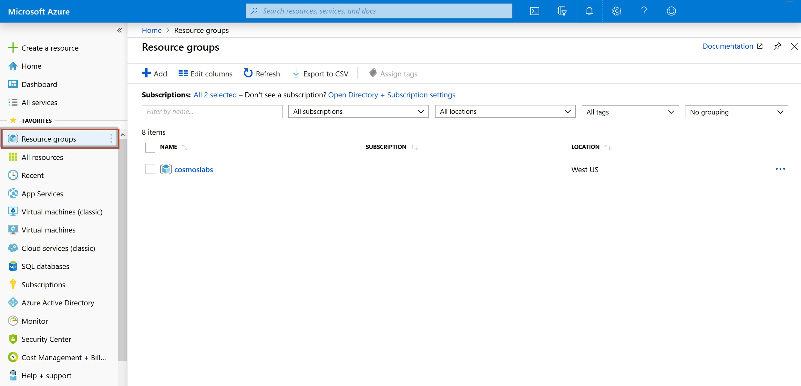

1. In the **Resource groups** blade, locate and select the **cosmoslabs** resource group.

    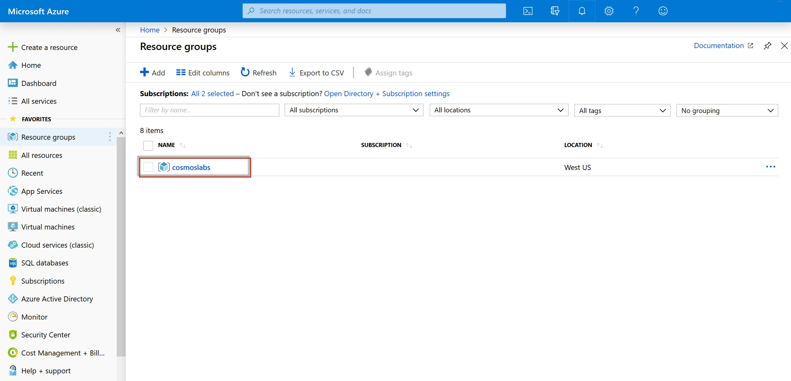

1. In the **cosmoslabs** blade, select the **Azure Cosmos DB** account you recently created.

    

1. In the **Azure Cosmos DB** blade, locate and select the **Overview** link on the left side of the blade. At the top select the **Add Container** button.

    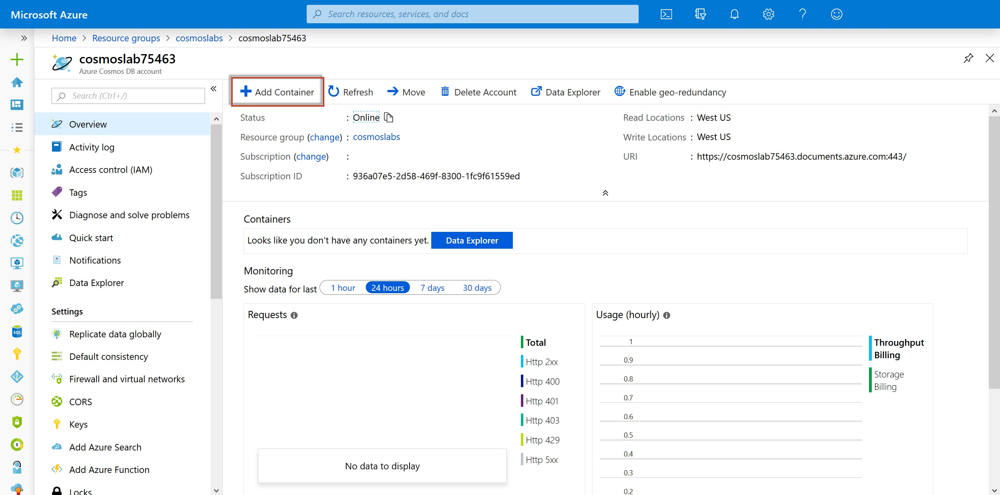

1. In the **Add Container** popup, perform the following actions:

    1. In the **Database id** field, select the **Create new** option and enter the value **ImportDatabase**.

    2. Do not check the **Provision database throughput** option.

        > Provisioning throughput for a database allows you to share the throughput among all the containers that belong to that database. Within an Azure Cosmos DB database, you can have a set of containers which shares the throughput as well as containers, which have dedicated throughput.

    3. In the **Container Id** field, enter the value **FoodCollection**.

    4. In the **Partition key** field, enter the value ``/foodGroup``.

    5. In the **Throughput** field, enter the value ``11000``. *Note: we will reduce this to 400 RU/s after the data has been imported*

    6. Select the **OK** button.

1. Wait for the creation of the new **database** and **container** to finish before moving on with this lab.

## Import Lab Data Into Container

You will use **Data Migration Tool(DM tool)** to import the JSON array stored in the **nutrition.json** file from `C:\Labs\setup\`

1. Use dtui application , double click on dtui application .
 
    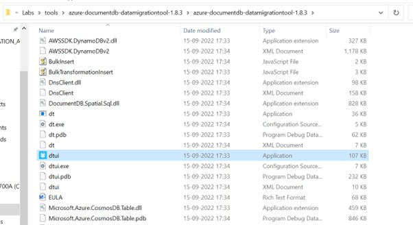
   
1. Navigate to Source Information as shown below

    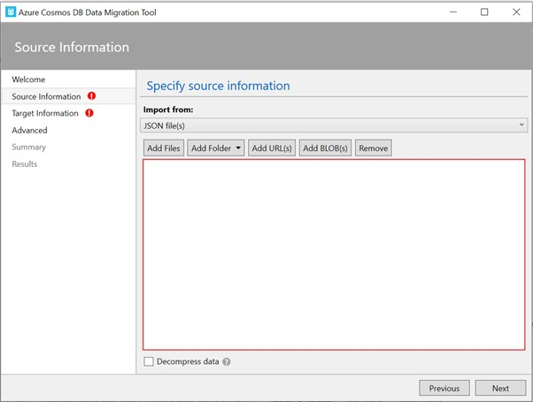
    
1. Select Import from as JSON files and click on Add files
    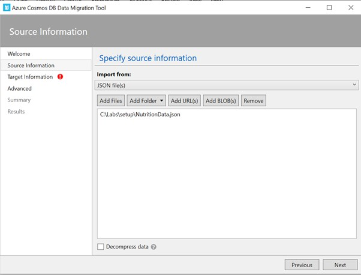
    
1. Select Nutrition.json file from path `C:\Labs\setup\` and it leads to Target information
    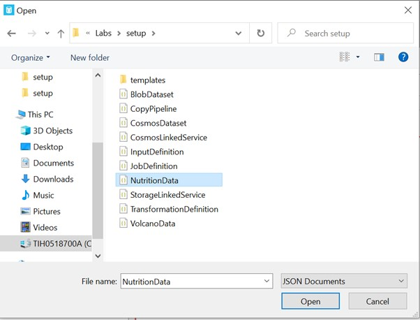
   
1. Copy the connection String from your Cosmos DB   
    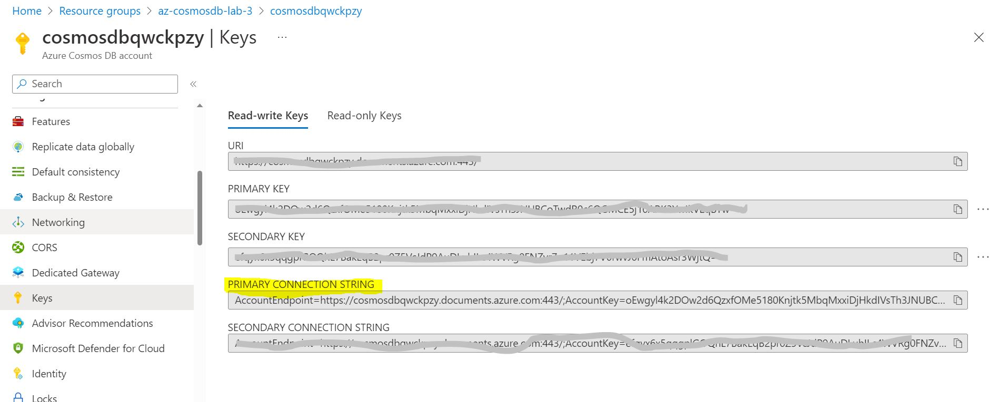
    
1. Append the Connection String with Database name and make collection as FoodCollection 
    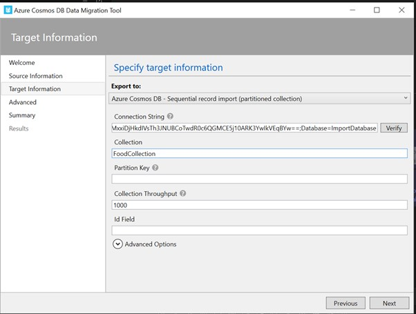
 
1. Click on Next and skip the Advanced settings.You will see Summary popup .
    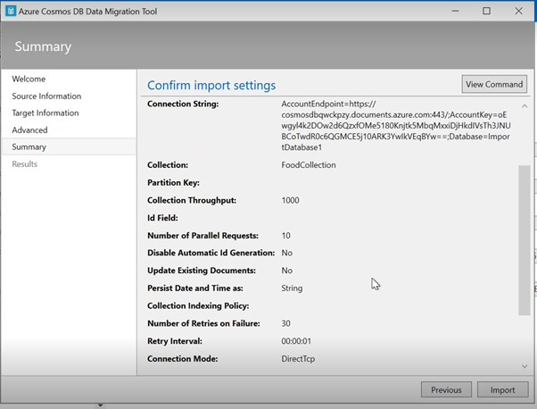
 
1. Click on Import and data gets copied from Source to Destination.
    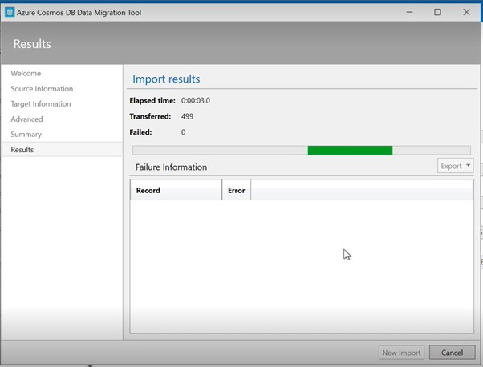

   

## Validate Imported Data

The Azure Cosmos DB Data Explorer allows you to view documents and run queries directly within the Azure Portal. In this exercise, you will use the Data Explorer to view the data stored in our container.

You will validate that the data was successfully imported into your container using the **Items** view in the **Data Explorer**.

1. Return to the **Azure Portal** (<http://portal.azure.com>).

1. On the left side of the portal, select the **Resource groups** link.

    

1. In the **Resource groups** blade, locate and select the **cosmoslabs** resource group.

    

1. In the **cosmoslabs** blade, select the **Azure Cosmos DB** account you recently created.

    

1. In the **Azure Cosmos DB** blade, locate and select the **Data Explorer** link on the left side of the blade.

    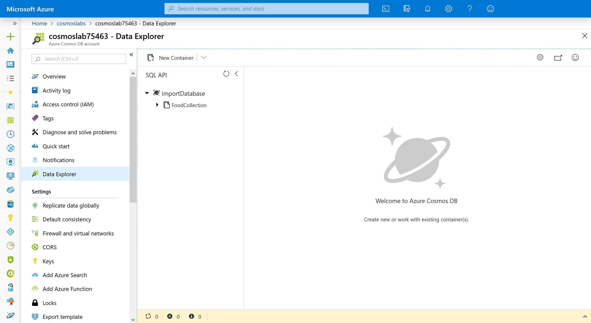

1. In the **Data Explorer** section, expand the **ImportDatabase** database node and then expand the **FoodCollection** container node.

    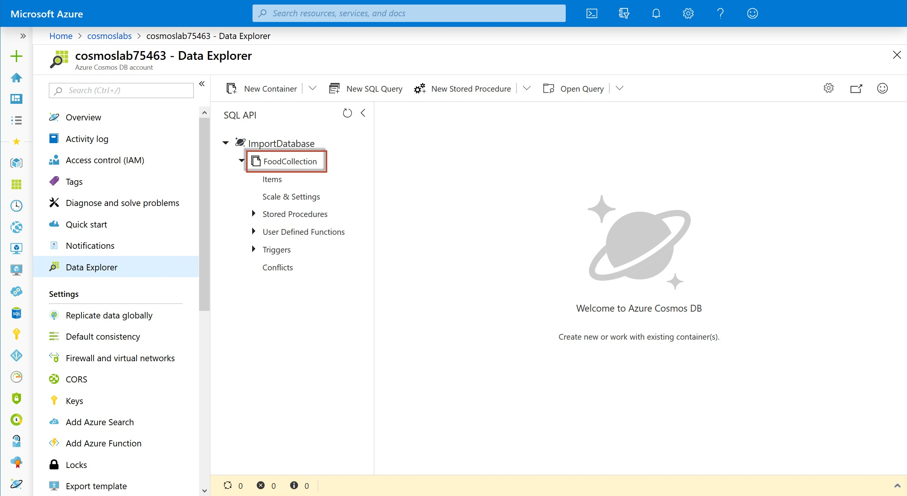

1. Within the **FoodCollection** node, select the **Scale and Settings** link to view the throughput for the container. Reduce the throughput to **400 RU/s**.

    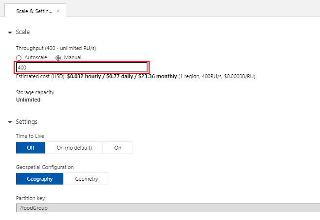

1. Within the **FoodCollection** node, select the **Items** link to view a subset of the various documents in the container. Select a few of the documents and observe the properties and structure of the documents.

    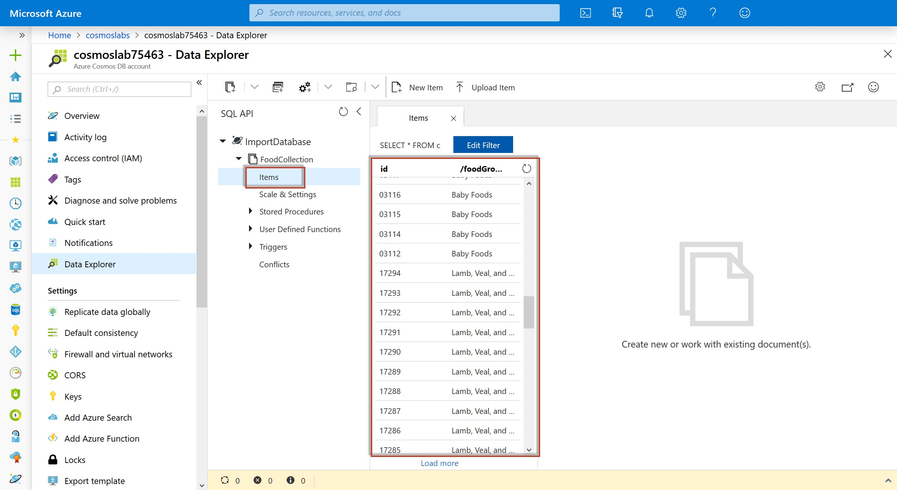

    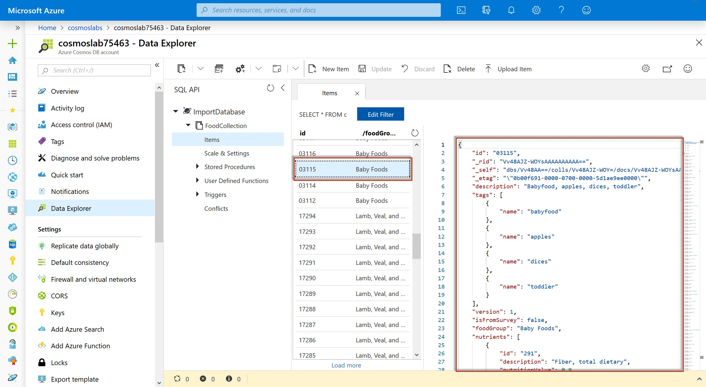

> If this is your final lab, follow the steps in [Removing Lab Assets](11-cleaning_up.md) to remove all lab resources.
> 
