# Load Data Into Cosmos DB with Dm Tool

In this lab, you will populate an Azure Cosmos DB container from an existing set of data using tools built in to Azure. After importing, you will use the Azure portal to view your imported data.

### Recommended Prerequisites 

- [Use Data migration tool to migrate your data to Azure Cosmos DB](https://learn.microsoft.com/en-us/azure/cosmos-db/import-data) 


## Create Azure Cosmos DB Database and Container

You will now create a database and container within your Azure Cosmos DB account.

1. Navigate to the [Azure Portal](https://portal.azure.com)

1. On the left side of the portal, select the **Resource groups** link.

    

1. In the **Resource groups** blade, locate and select the **cosmoslabs** resource group.

    

1. In the **cosmoslabs** blade, select the **Azure Cosmos DB** account you recently created.

    

1. In the Azure Cosmos DB blade, locate and select the Data Explorer link on the left side of the blade.

    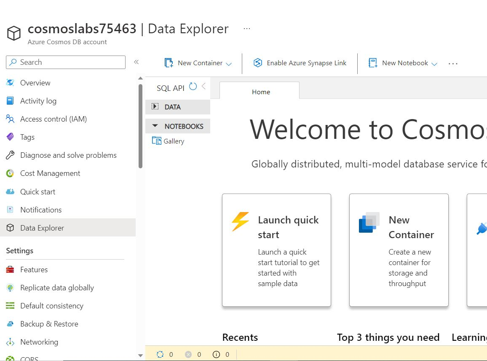

1. click on the **New container** dropdown  and select **New Database**:

    1. In the Database id field and enter the value **NutritionDatabase**.
    
       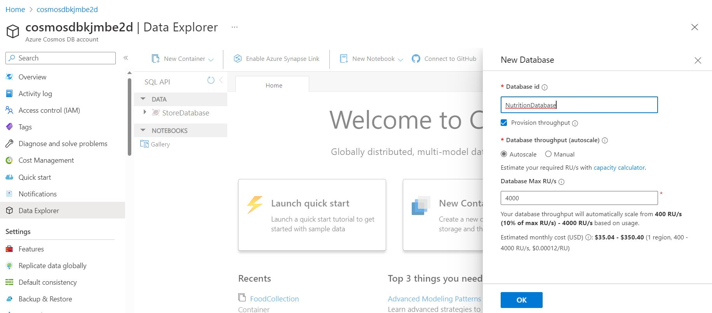
       
    2. Do not check the **Provision database throughput** option.

        > Provisioning throughput for a database allows you to share the throughput among all the containers that belong to that database. Within an Azure Cosmos DB database, you can have a set of containers which shares the throughput as well as containers, which have dedicated throughput.

         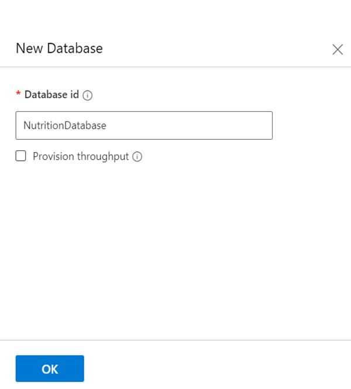

    3. Select the **OK** button.
    
    4. You will be able to see the **_NutritionDatabase_** database created .
        
        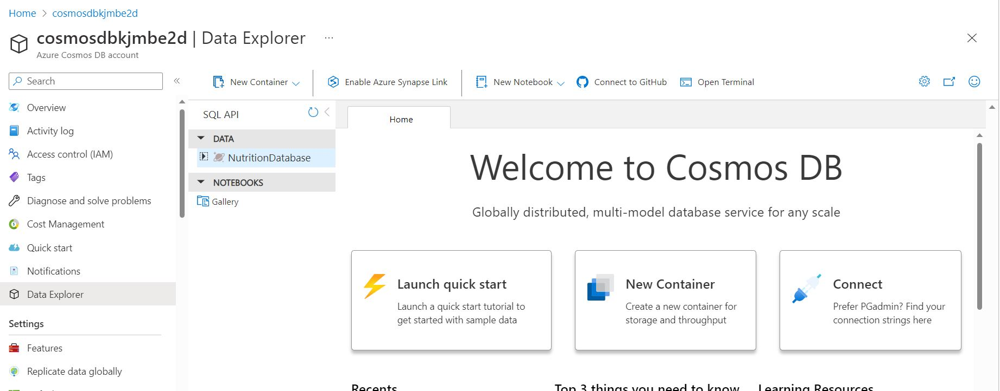

1. Wait for the creation of the new **database** and **container** to finish before moving on with this lab.

## Import Lab Data Into Container

You will use **Data Migration Tool(DM tool)** to import the JSON array stored in the **nutrition.json** file from `C:\Labs\setup\`.


1. Use dtui application from `C:\Labs\Tools\` location, double click on dtui application.
 
    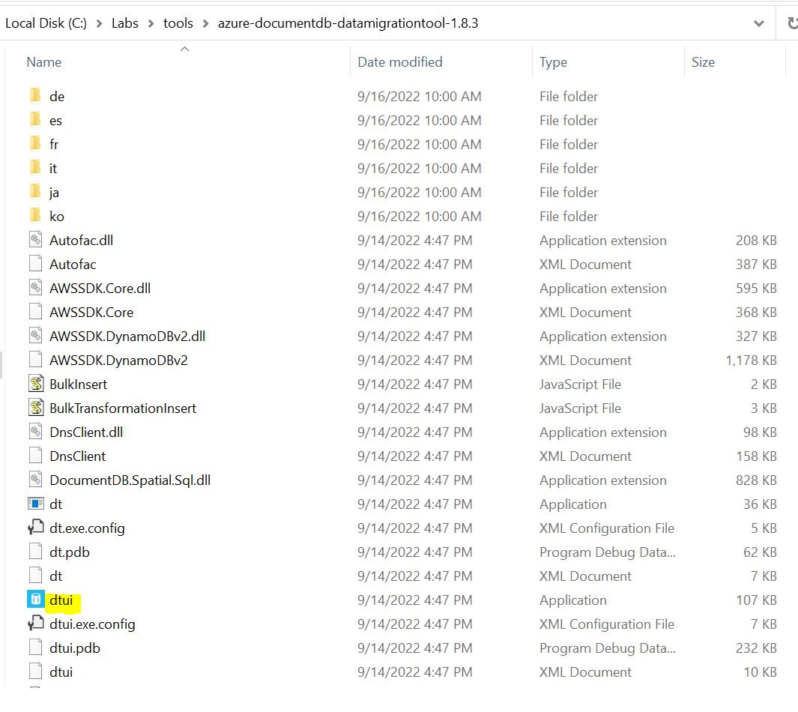
   
1. Navigate to Source Information as shown below.

    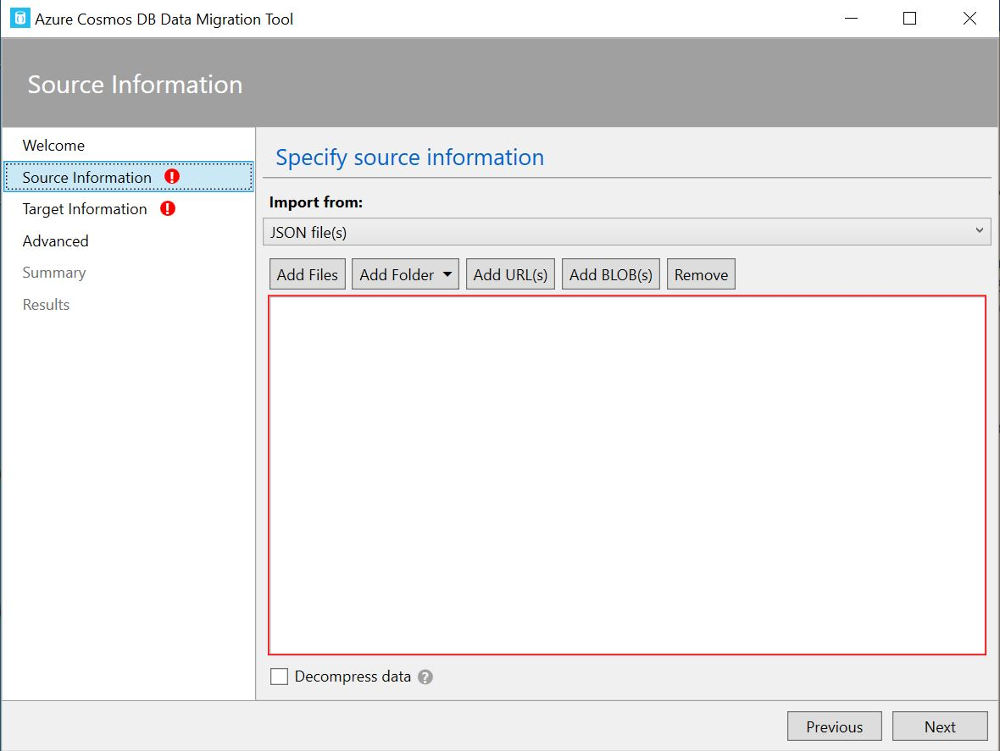
    
1. Select Import from as JSON files and click on Add files.

    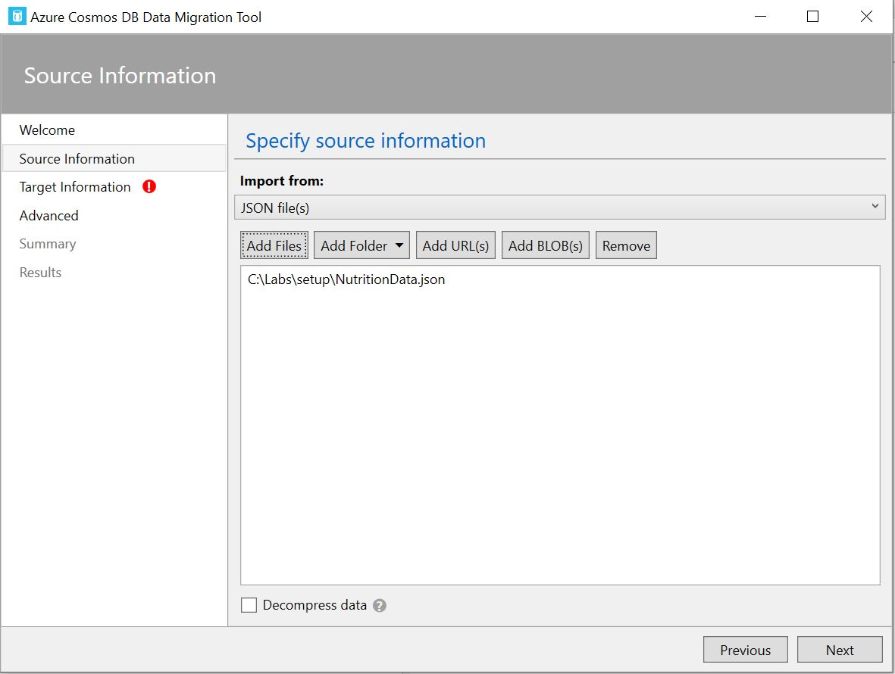
    
1. Select Nutrition.json file from path `C:\Labs\setup\` and it leads to Target information.

    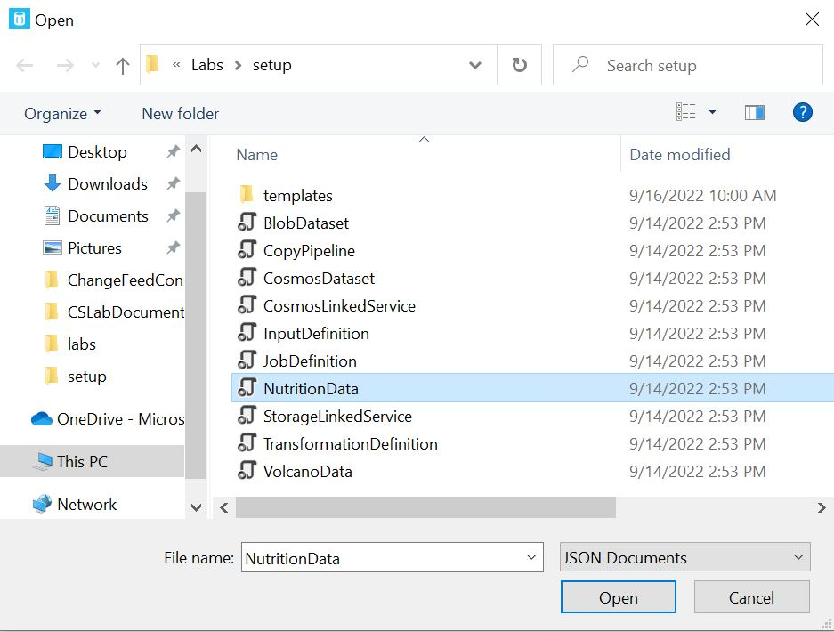
   
1. Copy the connection String from your Cosmos DB.
 
    
    
1. Append the Connection String with Database name and make collection as **_``FoodCollection``_**.

   > The connection string is in the following format: 
   
      ```sh
      AccountEndpoint=<CosmosDB Endpoint>;AccountKey=<CosmosDB Key>;Database=<CosmosDB Database>.
      ```
   > The  CosmosDB Endpoint is the endpoint URI. You can get this value from the Azure portal. Navigate to your Azure Cosmos DB account. Open the Overview pane and        copy the URI value. 
    
   > The AccountKey is the "Password" or PRIMARY KEY. You can get this value from the Azure portal. Navigate to your Azure Cosmos DB account. Open the Connection        Strings or Keys pane, and copy the "Password" or PRIMARY KEY value. 
    
   > The CosmosDB Database is the CosmosDB database name.    
     
   > In the **Partition key** field, enter the value **_``/foodGroup``_**.

   > In the **Collection Throughput** field, enter the value **``11000``**. *Note: we will reduce this to 400 RU/s after the data has been imported*.
   
   > Expand the **_Advanced options_** and replace the **number of Parallel Requests** to **``5``**

    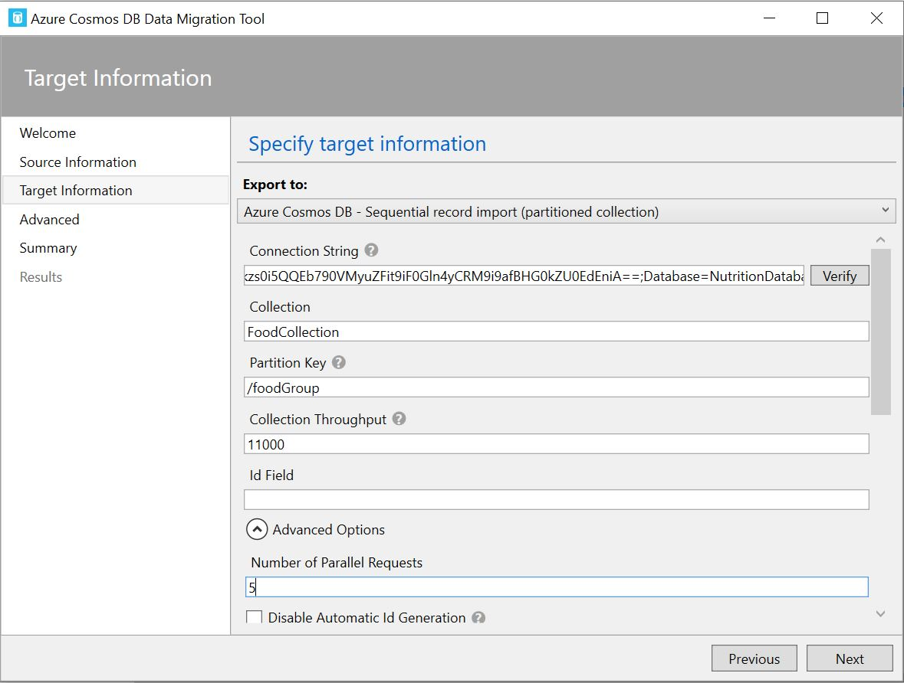
 
1. Click on Next and skip the Advanced Configuration.You will see Summary popup.

    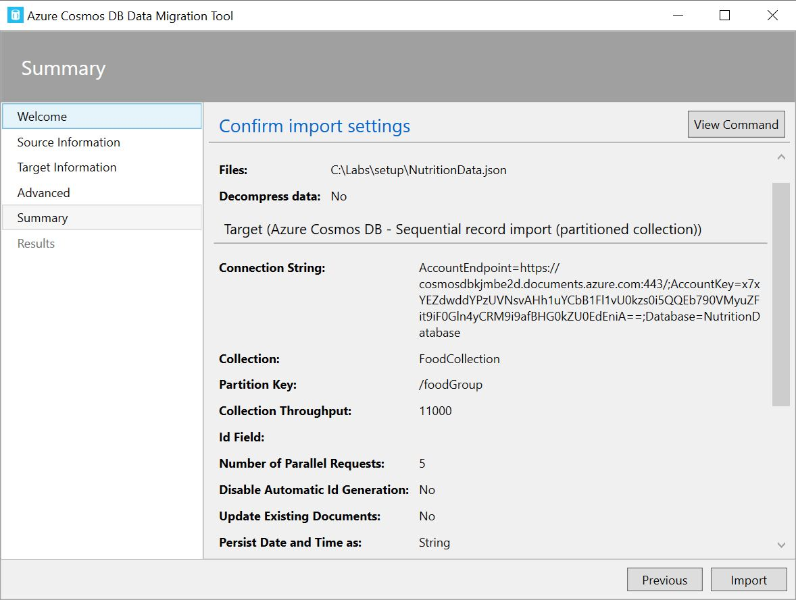
 
1. Click on Import and data gets copied from Source to Destination.

    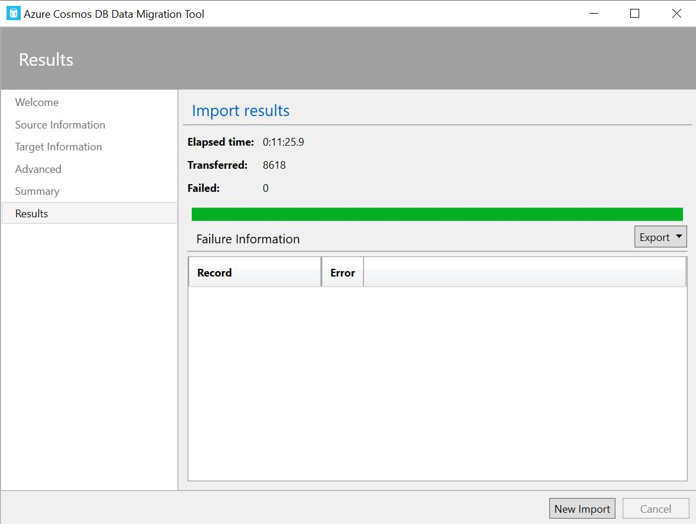

   

## Validate Imported Data

The Azure Cosmos DB Data Explorer allows you to view documents and run queries directly within the Azure Portal. In this exercise, you will use the Data Explorer to view the data stored in our container.

You will validate that the data was successfully imported into your container using the **Items** view in the **Data Explorer**.

1. Return to the **Azure Portal** (<http://portal.azure.com>).

1. On the left side of the portal, select the **Resource groups** link.

    

1. In the **Resource groups** blade, locate and select the **cosmoslabs** resource group.

    

1. In the **cosmoslabs** blade, select the **Azure Cosmos DB** account you recently created.

    

1. In the **Azure Cosmos DB** blade, locate and select the **Data Explorer** link on the left side of the blade.

    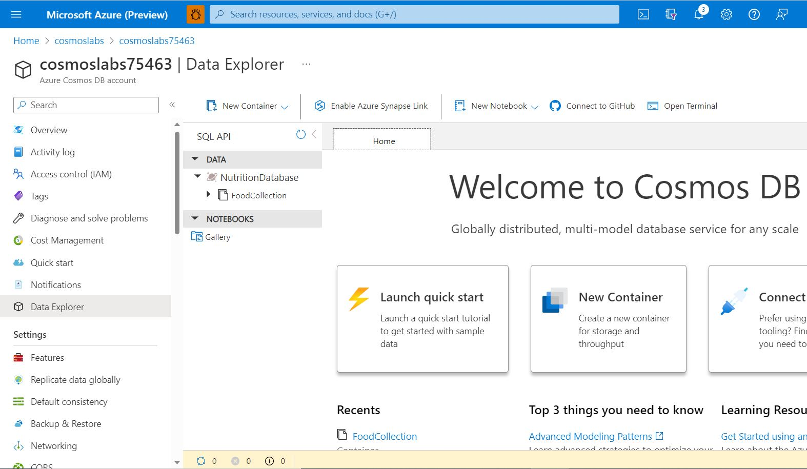

1. In the **Data Explorer** section, expand the **NutritionDatabase** database node and then expand the **FoodCollection** container node.

    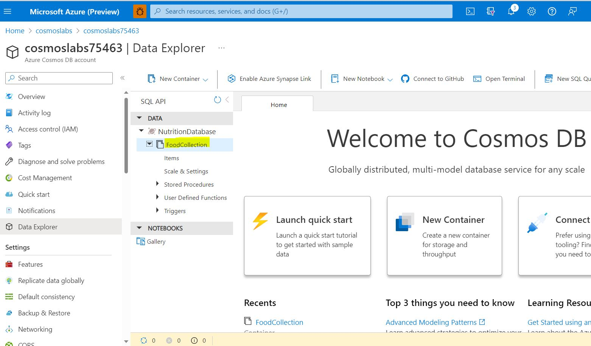

1. Within the **FoodCollection** node, select the **Scale and Settings** link to view the throughput for the container. Reduce the throughput to **400 RU/s**.

    

1. Within the **FoodCollection** node, select the **Items** link to view a subset of the various documents in the container. Select a few of the documents and observe the properties and structure of the documents.

    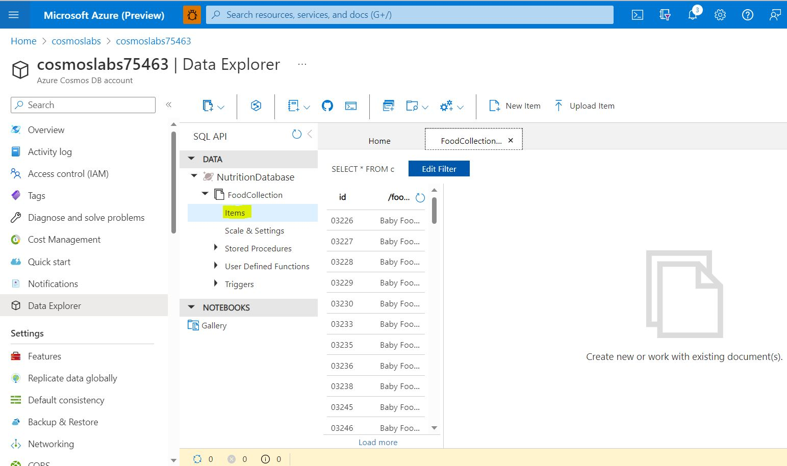

    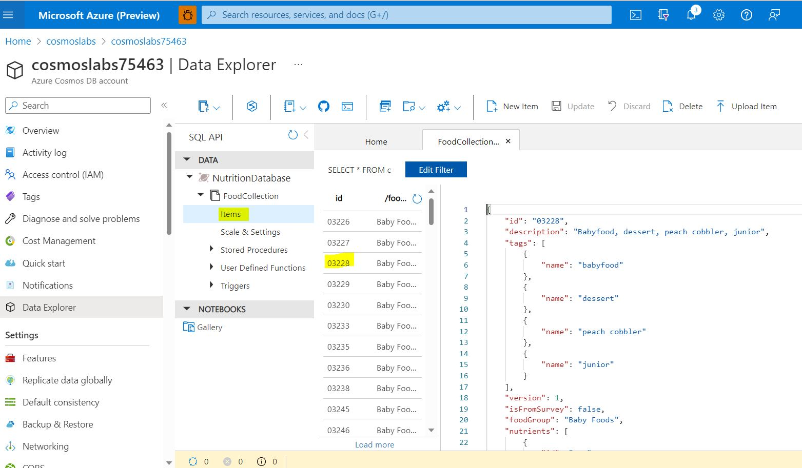

