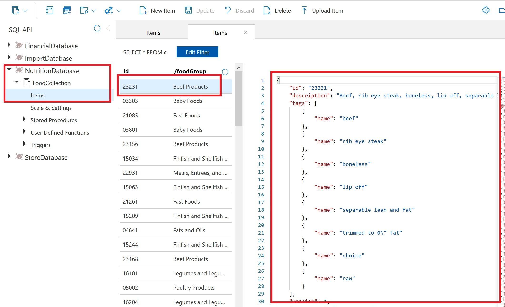
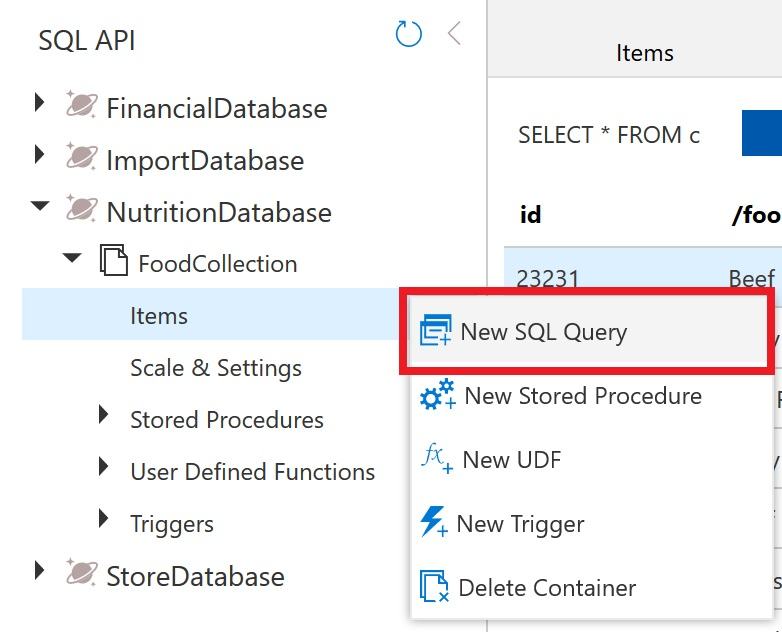
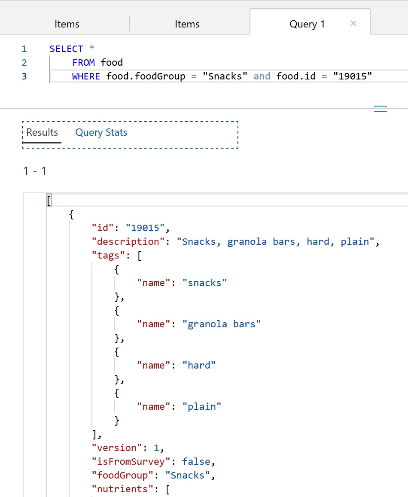

# Querying in Azure Cosmos DB

Azure Cosmos DB SQL API accounts provide support for querying items using the Structured Query Language (SQL), one of the most familiar and popular query languages, as a JSON query language. In this lab, you will explore how to use these rich query capabilities directly through the Azure Portal. No separate tools or client side code are required.

### Recommended Prerequisites 

1. [Execute queries in Azure Cosmos DB](https://learn.microsoft.com/en-gb/training/paths/execute-queries-azure-cosmos-db-sql-api/)

## Query Overview

Querying JSON with SQL allows Azure Cosmos DB to combine the advantages of a legacy relational databases with a NoSQL database. You can use many rich query capabilities such as sub-queries or aggregation functions but still retain the many advantages of modeling data in a NoSQL database.

Azure Cosmos DB supports strict JSON items only. The type system and expressions are restricted to deal only with JSON types. For more information, see the [JSON specification](https://www.json.org/).

## Running your first query

In this lab section, you will query your **FoodCollection**. You must complete [Lab 02 - Load Data Into Cosmos DB with Dm Tool](https://github.com/CSALabsAutomation/azure-cosmosdb-lab/blob/main/steps/02_load-data-into-cosmos-db-with-dmtool/documentation.md) before starting this lab.

You will begin by running basic queries with `SELECT`, `WHERE`, and `FROM` clauses.

### Open Data Explorer

1. In the **Azure Cosmos DB** blade, locate and select the **Data Explorer** link on the left side of the blade.
2. In the **Data Explorer** section, expand the **NutritionDatabase** database node and then expand the **FoodCollection** container node.
3. Within the **FoodCollection** node, select the **Items** link.
4. View the items within the container. Observe how these documents have many properties, including arrays.

    

5. Select **New SQL Query**.

      

6. Paste the following SQL query and select **Execute Query**.

    ```sql
    SELECT *
    FROM food
    WHERE food.foodGroup = "Snacks" and food.id = "19015"
    ```

7. You will see that the query returned the single document where id is "19015" and the foodGroup is "Snacks". Explore the structure of this item as it is representative of the items within the **FoodCollection** container that we will be working with for the remainder of this section.

      

## Dot and quoted property projection accessors

You can choose which properties of the document to project into the result using the dot notation. If you wanted to return only the item's id you could run the query below.

Select **New SQL Query**. Paste the following SQL query and selecting **Execute Query**.

```sql
SELECT food.id
FROM food
WHERE food.foodGroup = "Snacks" and food.id = "19015"
```

Though less common, you can also access properties using the quoted property operator [""]. For example, SELECT food.id and SELECT food["id"] are equivalent. This syntax is useful to escape a property that contains spaces, special characters, or has the same name as a SQL keyword or reserved word.

```sql
SELECT food["id"]
FROM food
WHERE food["foodGroup"] = "Snacks" and food["id"] = "19015"
```

## WHERE clauses

Let’s explore WHERE clauses. You can add complex scalar expressions including arithmetic, comparison and logical operators in the WHERE clause.

Run the below query by selecting the **New SQL Query**.

Paste the following SQL query and then select **Execute Query**.

```sql
SELECT food.id,
food.description,
food.tags,
food.foodGroup,
food.version
FROM food
WHERE (food.manufacturerName = "The Coca-Cola Company" AND food.version > 0)
```

This query will return the id, description, servings, tags, foodGroup, manufacturerName and version for items with "The Coca-Cola Company" for manufacturerName and a version greater than 0.

Your first result document should be:

```json
{
  "id": "14026",
  "description": "Beverages, Energy Drink, sugar-free with guarana",
  "tags": [
    {
      "name": "beverages"
    },
    {
      "name": "energy drink"
    },
    {
      "name": "sugar-free with guarana"
    }
  ],
  "foodGroup": "Beverages",
  "manufacturerName": "The Coca-Cola Company",
  "version": 1
}
```

You should note that where the query returned the results of tags node it projected the entire contents of the property which in this case is an array.

## Advanced projection

Azure Cosmos DB supports several forms of transformation on the resultant JSON. One of the simplest is to alias your JSON elements using the AS aliasing keyword as you project your results.

By running the query below you will see that the element names are transformed. In addition, the projection is accessing only the first element in the servings array for all items specified by the WHERE clause.

Run the below query by selecting the **New SQL Query**.

Paste the following SQL query and then select **Execute Query**.

```sql
SELECT food.description,
food.foodGroup,
food.servings[0].description AS servingDescription,
food.servings[0].weightInGrams AS servingWeight
FROM food
WHERE food.foodGroup = "Fruits and Fruit Juices"
AND food.servings[0].description = "cup"
```

## ORDER BY clause

Azure Cosmos DB supports adding an ORDER BY clause to sort results based on one or more properties

Run the below query by selecting the **New SQL Query**.

Paste the following SQL query and then select **Execute Query**.

```sql
SELECT food.description,
food.foodGroup,
food.servings[0].description AS servingDescription,
food.servings[0].weightInGrams AS servingWeight
FROM food
WHERE food.foodGroup = "Fruits and Fruit Juices" AND food.servings[0].description = "cup"
ORDER BY food.servings[0].weightInGrams DESC
```

You can learn more about configuring the required indexes for an Order By clause in the later Indexing Lab or by reading [our docs](
https://docs.microsoft.com/en-us/azure/cosmos-db/sql-query-order-by).

## Limiting query result size

Azure Cosmos DB supports the TOP keyword. TOP can be used to limit the number of returning values from a query.

Run the query below to see the top 20 results.

```sql
SELECT TOP 20 food.id,
food.description,
food.tags,
food.foodGroup
FROM food
WHERE food.foodGroup = "Snacks"
```

The OFFSET LIMIT clause is an optional clause to skip then take some number of values from the query. The OFFSET count and the LIMIT count are required in the OFFSET LIMIT clause.

```sql
SELECT food.id,
food.description,
food.tags,
food.foodGroup
FROM food
WHERE food.foodGroup = "Snacks"
ORDER BY food.id
OFFSET 10 LIMIT 10
```

When OFFSET LIMIT is used in conjunction with an ORDER BY clause, the result set is produced by doing skip and take on the ordered values. If no ORDER BY clause is used, it will result in a deterministic order of values.

## More advanced filtering

Let’s add the IN and BETWEEN keywords into our queries. IN can be used to check whether a specified value matches any element in a given list and BETWEEN can be used to run queries against a range of values.

Run the query below:

```sql
SELECT food.id,
food.description,
food.tags,
food.foodGroup,
food.version
FROM food
WHERE food.foodGroup IN ("Poultry Products", "Sausages and Luncheon Meats")
    AND (food.id BETWEEN "05740" AND "07050")
```

## More advanced projection

Azure Cosmos DB supports JSON projection within its queries. Let’s project a new JSON Object with modified property names.

Run the query below to see the results.

```sql
SELECT {
"Company": food.manufacturerName,
"Brand": food.commonName,
"Serving Description": food.servings[0].description,
"Serving in Grams": food.servings[0].weightInGrams,
"Food Group": food.foodGroup
} AS Food
FROM food
WHERE food.id = "21421"
```

## JOIN within your documents

Azure Cosmos DB’s JOIN supports intra-document and self-joins. Azure Cosmos DB does not support JOINs across documents or containers.

In an earlier query example we returned a result with attributes of just the first serving of the food.servings array. By using the join syntax below, we can now return an item in the result for every item within the serving array while still being able to project the attributes from elsewhere in the item.

Run the query below to iterate on the food document’s servings.

```sql
SELECT
food.id as FoodID,
serving.description as ServingDescription
FROM food
JOIN serving IN food.servings
WHERE food.id = "03226"
```

JOINs are useful if you need to filter on properties within an array. Run the below example that has filter after the intra-document JOIN.

```sql
SELECT VALUE COUNT(1)
FROM c
JOIN t IN c.tags
JOIN s IN c.servings
WHERE t.name = 'infant formula' AND s.amount > 1
```

## System functions

Azure Cosmos DB supports a number of built-in functions for common operations. They cover mathematical functions like ABS, FLOOR and ROUND and type checking functions like IS_ARRAY, IS_BOOL and IS_DEFINED. [Learn more about supported system functions](https://docs.microsoft.com/en-us/azure/cosmos-db/sql-query-system-functions).

Run the query below to see example use of some system functions

```sql
SELECT food.id,
food.commonName,
food.foodGroup,
ROUND(nutrient.nutritionValue) AS amount,
nutrient.units
FROM food JOIN nutrient IN food.nutrients
WHERE IS_DEFINED(food.commonName)
AND nutrient.description = "Water"
AND food.foodGroup IN ("Sausages and Luncheon Meats", "Legumes and Legume Products")
AND food.id > "42178"
```

## Correlated sub-queries

In many scenarios, a sub-query may be effective. A correlated sub-query is a query that references values from an outer query. We will walk through some of the most useful examples here. You can [learn more about subqueries](https://docs.microsoft.com/en-us/azure/cosmos-db/sql-query-subquery).

There are two types of sub-queries: Multi-value sub-queries and scalar sub-queries. Multi-value sub-queries return a set of documents and are always used within the FROM clause. A scalar sub-query expression is a sub-query that evaluates to a single value.

### Multi-value subqueries

You can optimize JOIN expressions with a sub-query.

Consider the following query which performs a self-join and then applies a filter on name, nutritionValue, and amount. We can use a sub-query to filter out the joined array items before joining with the next expression.

```sql
SELECT VALUE COUNT(1)
FROM c
JOIN t IN c.tags
JOIN n IN c.nutrients
JOIN s IN c.servings
WHERE t.name = 'infant formula' AND (n.nutritionValue > 0
AND n.nutritionValue < 10) AND s.amount > 1
```

We could rewrite this query using three sub-queries to optimize and reduce the Request Unit (RU) charge. Observe that the multi-value sub-query always appears in the FROM clause of the outer query.

```sql
SELECT VALUE COUNT(1)
FROM c
JOIN (SELECT VALUE t FROM t IN c.tags WHERE t.name = 'infant formula')
JOIN (SELECT VALUE n FROM n IN c.nutrients WHERE n.nutritionValue > 0 AND n.nutritionValue < 10)
JOIN (SELECT VALUE s FROM s IN c.servings WHERE s.amount > 1)
```

### Scalar sub-queries

One use case of scalar sub-queries is rewriting ARRAY_CONTAINS as EXISTS.

Consider the following query that uses ARRAY_CONTAINS:

```sql
SELECT TOP 5 f.id, f.tags
FROM food f
WHERE ARRAY_CONTAINS(f.tags, {name: 'orange'})
```

Run the following query which has the same results but uses EXISTS:

```sql
SELECT TOP 5 f.id, f.tags
FROM food f
WHERE EXISTS(SELECT VALUE t FROM t IN f.tags WHERE t.name = 'orange')
```

The major advantage of using EXISTS is the ability to have complex filters in the EXISTS function, rather than just the simple equality filters which ARRAY_CONTAINS permits. 

Here is an example:

```sql
SELECT VALUE c.description
FROM c
JOIN n IN c.nutrients
WHERE n.units= "mg" AND n.nutritionValue > 0
```


