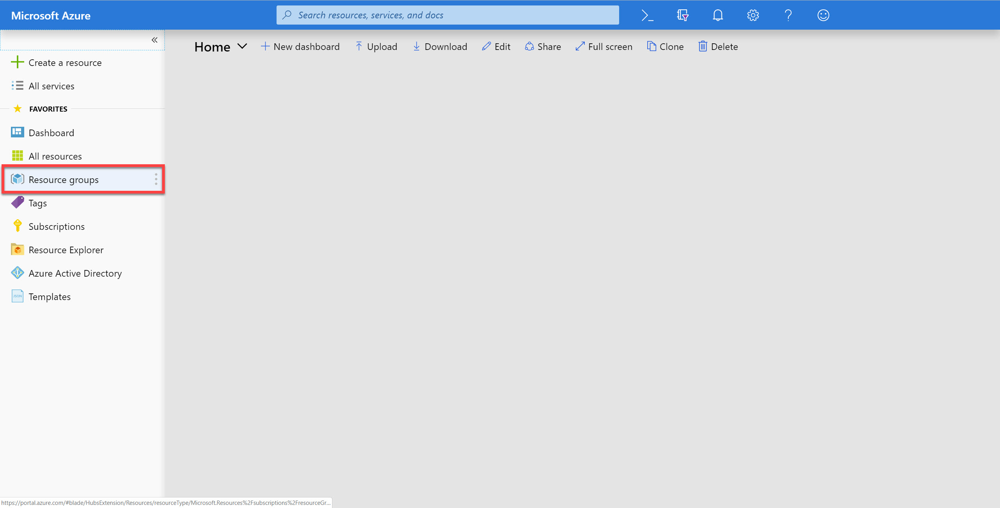

## Log-in to the Azure Portal

1. In a new window, sign in to the **Azure Portal** (<https://portal.azure.com>).

1. Once you have logged in, you may be prompted to start a tour of the Azure portal. You can safely skip this step.

### Retrieve Account Credentials

The .NET SDK requires credentials to connect to your Azure Cosmos DB account. You will collect and store these credentials for use throughout the lab.

1. On the left side of the portal, select the **Resource groups** link.

   

1. In the **Resource groups** blade, locate and select the **cosmoslabs** _Resource Group_.

   

1. In the **cosmoslabs** blade, select the **Azure Cosmos DB** account you recently created.

   

1. In the **Azure Cosmos DB** blade, locate the **Settings** section and select the **Keys** link.

   

1. In the **Keys** pane, record the values in the **CONNECTION STRING**, **URI** and **PRIMARY KEY** fields. You will use these values later in this lab.

   
