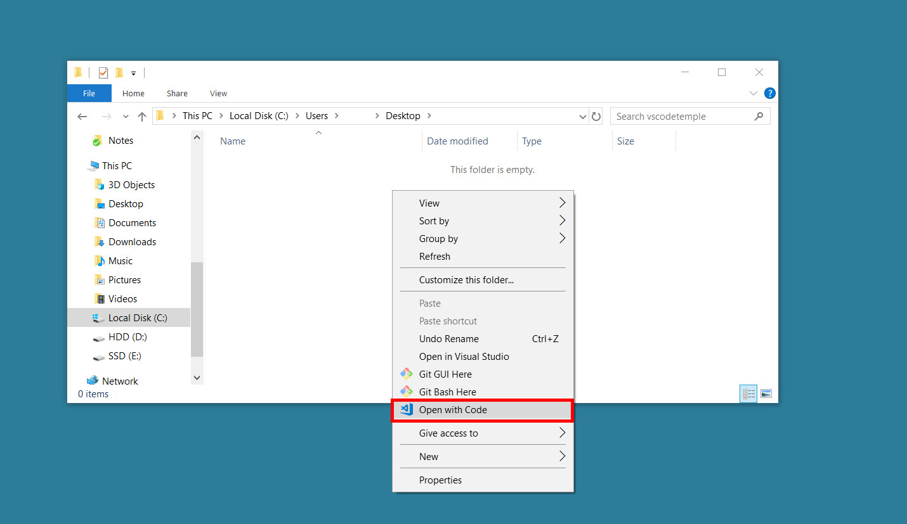
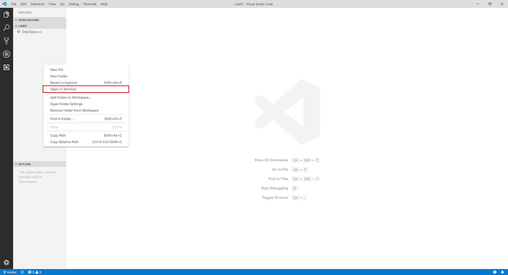
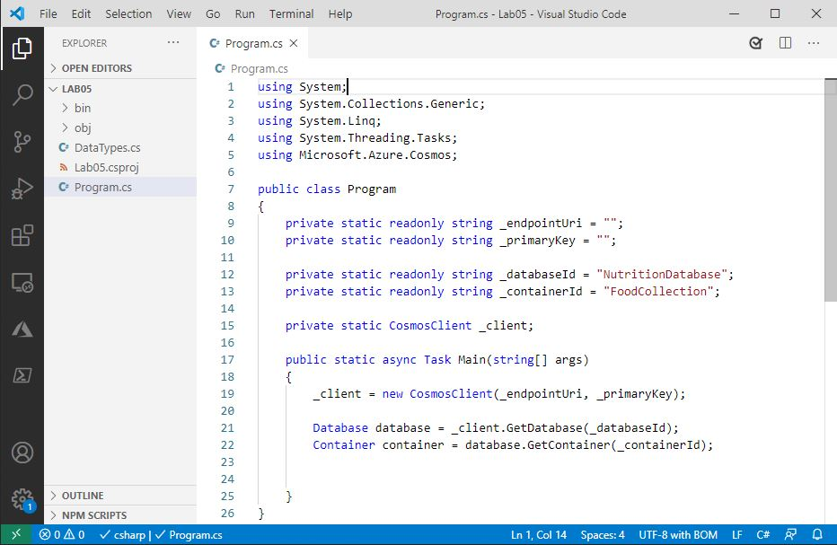

# Build A Simple .NET Console App

After using the Azure Portal's **Data Explorer** to query an Azure Cosmos DB container in Lab 3, you are now going to use the .NET SDK to issue similar queries.

### Recommended Prerequisites 

- [Use the Azure Cosmos DB SQL API SDK](https://learn.microsoft.com/en-gb/training/modules/use-azure-cosmos-db-sql-api-sdk/)

## Create a .NET Core Project

1. Create `Lab05` folder that will be used to contain the content of your .NET Core project.

2. In the `Lab05` folder, right-click the folder and select the **Open with Code** menu option.

   

   > Alternatively, you can run a terminal in your current directory and execute the `code .` command.

3. In the Visual Studio Code window that appears, right-click the **Explorer** pane and select the **Open in Terminal** menu option.

   

4. In the open terminal pane, enter and execute the following command:

    ```sh
    dotnet new console
    ```

    > This command will create a new .NET Core project. The project will be a **console** project.

5. Visual Studio Code will most likely prompt you to install various extensions related to **.NET Core** or **Azure Cosmos DB** development. None of these extensions are required to complete the labs.

1. In the terminal pane, enter and execute the following command:

    ```sh
    dotnet add package Microsoft.Azure.Cosmos --version 3.12.0
    ```

    > This command will add the [Microsoft.Azure.Cosmos](https://www.nuget.org/packages/Microsoft.Azure.Cosmos/) NuGet package as a project dependency. The lab instructions have been tested using the `3.12.0` version of this NuGet package.

6. In the terminal pane, enter and execute the following command:

   ```sh
   dotnet restore
   ```

   > This command will restore all packages specified as dependencies in the project.

7. In the terminal pane, enter and execute the following command:

   ```sh
   dotnet build
   ```

   > This command will build the project.

8. In the **Explorer** pane verify that you have a `DataTypes.cs` file in your project folder.

   > This file contains the data classes you will be working with in the following steps.

9. Select the `Program.cs` link in the **Explorer** pane to open the file in the editor.

      

 1. Within the Program.cs editor tab, Add the following using blocks to the top of the editor:

    ```sh
    using System;
    using System.Collections.Generic;
    using System.Linq;
    using System.Threading.Tasks;
    using Microsoft.Azure.Cosmos;
    ```
1. Within the Program class, add the following lines of code which creates variables for your connection information and Cosmos client. Database and Container info has to be added. Also **main()** method structure has to be added as given below.
   
   ```sh
    public class Program
   {
         private static readonly string _endpointUri = "<your uri>";
         private static readonly string _primaryKey = "<your key>";
         private static readonly string _databaseId = "<Your Database>";
         private static readonly string _containerId = "<Your Container>";
         private static CosmosClient _client = new CosmosClient(_endpointUri, _primaryKey);

    public static async Task Main(string[] args)
      {

      }
    }
    ```
    
10. For the `_endpointUri` variable, replace the placeholder value with the **URI** value and for the `_primaryKey` variable, replace the placeholder value with the **PRIMARY KEY** value from your Azure Cosmos DB account. Use [these instructions](https://github.com/CSALabsAutomation/azure-cosmosdb-lab/blob/main/steps/01_creating-a-partitioned-container/documentation.md) to get these values if you do not already have them:

    - For example, if your **uri** is `https://cosmosacct.documents.azure.com:443/`, your new variable assignment will look like this:

    ```csharp
    private static readonly string _endpointUri = "https://cosmosacct.documents.azure.com:443/";
    ```

    - For example, if your **primary key** is `elzirrKCnXlacvh1CRAnQdYVbVLspmYHQyYrhx0PltHi8wn5lHVHFnd1Xm3ad5cn4TUcH4U0MSeHsVykkFPHpQ==`, your new variable assignment will look like this:

    ```csharp
    private static readonly string _primaryKey = "elzirrKCnXlacvh1CRAnQdYVbVLspmYHQyYrhx0PltHi8wn5lHVHFnd1Xm3ad5cn4TUcH4U0MSeHsVykkFPHpQ==";
    ```
    

## Read a single Document in Azure Cosmos DB Using ReadItemAsync

ReadItemAsync allows a single item to be retrieved from Cosmos DB by its ID. In Azure Cosmos DB, this is the most efficient method of reading a single document.

1. Add the following code within the `Main()` method:

    ```csharp
    Database database = _client.GetDatabase(_databaseId);
    Container container = database.GetContainer(_containerId);
    ```

1. Add the following lines of code to use the `ReadItemAsync()` function to retrieve a single item from your Cosmos DB by its `id` and write its description to the console.

    ```csharp
    ItemResponse<Food> candyResponse = await container.ReadItemAsync<Food>("19130", new PartitionKey("Sweets"));
    Food candy = candyResponse.Resource;
    Console.Out.WriteLine($"Read {candy.Description}");
    ```

1. Save all of your open tabs in Visual Studio Code

1. In the open terminal pane, enter and execute the following command:

   ```sh
   dotnet run
   ```

1. You should see the following line output in the console, indicating that `ReadItemAsync()` completed successfully:

   ```sh
   Read Candies, HERSHEY''S POT OF GOLD Almond Bar
   ```

## Execute a Query Against a Single Azure Cosmos DB Partition

1. Return to `program.cs` file editor window

1. Find the last line of code you wrote:

    ```csharp
    Console.Out.WriteLine($"Read {candy.Description}");
    ```

1. Create a SQL Query against your data, as follows:

    ```csharp
    string sqlA = "SELECT f.description, f.manufacturerName, f.servings FROM foods f WHERE f.foodGroup = 'Sweets' and IS_DEFINED(f.description) and IS_DEFINED(f.manufacturerName) and IS_DEFINED(f.servings)";
    ```

    > This query will select all food where the foodGroup is set to the value `Sweets`. It will also only select documents that have description, manufacturerName, and servings properties defined. You'll note that the syntax is very familiar if you've done work with SQL before. Also note that because this query has the partition key in the WHERE clause, this query can execute within a single partition.

1. Add the following code to execute and read the results of this query

   ```csharp
   FeedIterator<Food> queryA = container.GetItemQueryIterator<Food>(new QueryDefinition(sqlA), requestOptions: new QueryRequestOptions{MaxConcurrency = 1});
   foreach (Food food in await queryA.ReadNextAsync())
   {
       await Console.Out.WriteLineAsync($"{food.Description} by {food.ManufacturerName}");
       foreach (Serving serving in food.Servings)
       {
           await Console.Out.WriteLineAsync($"\t{serving.Amount} {serving.Description}");
       }
       await Console.Out.WriteLineAsync();
   }
   ```

1. Save all of your open tabs in Visual Studio Code

1. In the open terminal pane, enter and execute the following command:

    ```sh
    dotnet run
    ```

1. The code will loop through each result of the SQL query and output a message to the console similar to the following:

    ```sh
    ...

    Puddings, coconut cream, dry mix, instant by
        1 package (3.5 oz)
        1 portion, amount to make 1/2 cup

    ...
    ```

### Execute a Query Against Multiple Azure Cosmos DB Partitions

1. Return to `program.cs` file editor window

2. Following your `foreach` loop, create a SQL Query against your data, as follows:

    ```csharp
    string sqlB = @"SELECT f.id, f.description, f.manufacturerName, f.servings FROM foods f WHERE IS_DEFINED(f.manufacturerName)";
    ```

3. Add the following line of code after the definition of `sqlB` to create your next item query:

    ```csharp
    FeedIterator<Food> queryB = container.GetItemQueryIterator<Food>(sqlB, requestOptions: new QueryRequestOptions{MaxConcurrency = 5, MaxItemCount = 100});
    ```

    > Take note of the differences in this call to `GetItemQueryIterator()` as compared to the previous section. **MaxConcurrency** is set to `5`. MaxConcurrency Sets the maximum number of simultaneous network connections to the container's partitions. If you set this property to -1, the SDK manages the degree of parallelism. If the MaxConcurrency set to 0, there is a single network connection to the container's partitions. MaxItemCount trades query latency versus client-side memory utilization. If this option is omitted or to set to -1, the SDK manages the number of items buffered during parallel query execution. We are limiting the **MaxItemCount** to `100` items. This will result in paging if there are more than 100 items that match the query.

4. Add the following lines of code to page through the results of this query using a while loop.

    ```csharp
    int pageCount = 0;
    while (queryB.HasMoreResults)
    {
        Console.Out.WriteLine($"---Page #{++pageCount:0000}---");
        foreach (var food in await queryB.ReadNextAsync())
        {
            Console.Out.WriteLine($"\t[{food.Id}]\t{food.Description,-20}\t{food.ManufacturerName,-40}");
        }
    }
    ```

5. Save all of your open tabs in Visual Studio Code

6. At end of this point, your Program.cs file should look like this:

```csharp
using System;
using System.Collections.Generic;
using System.Linq;
using System.Threading.Tasks;
using Microsoft.Azure.Cosmos;

public class Program
{
    private static readonly string _endpointUri = "";
    private static readonly string _primaryKey = "";

    private static readonly string _databaseId = "NutritionDatabase";
    private static readonly string _containerId = "FoodCollection";
    private static CosmosClient _client = new CosmosClient(_endpointUri, _primaryKey);

    public static async Task Main(string[] args)
    {
        Database database = _client.GetDatabase(_databaseId);
        Container container = database.GetContainer(_containerId);

        ItemResponse<Food> candyResponse = await container.ReadItemAsync<Food>("19130", new PartitionKey("Sweets"));
        Food candy = candyResponse.Resource;
         Console.Out.WriteLine($"Read {candy.Description}");

         string sqlA = "SELECT f.description, f.manufacturerName, f.servings FROM foods f WHERE f.foodGroup = 'Sweets' and IS_DEFINED(f.description) and IS_DEFINED(f.manufacturerName) and IS_DEFINED(f.servings)";
        FeedIterator<Food> queryA = container.GetItemQueryIterator<Food>(new QueryDefinition(sqlA), requestOptions: new QueryRequestOptions{MaxConcurrency = 1});
         foreach (Food food in await queryA.ReadNextAsync())
         {
         await Console.Out.WriteLineAsync($"{food.Description} by {food.ManufacturerName}");
         foreach (Serving serving in food.Servings)
         {
        await Console.Out.WriteLineAsync($"\t{serving.Amount} {serving.Description}");
         }
          await Console.Out.WriteLineAsync();
         }

         string sqlB = @"SELECT f.id, f.description, f.manufacturerName, f.servings FROM foods f WHERE IS_DEFINED(f.manufacturerName)";
         FeedIterator<Food> queryB = container.GetItemQueryIterator<Food>(sqlB, requestOptions: new QueryRequestOptions{MaxConcurrency = 5, MaxItemCount = 100});
         int pageCount = 0;
         while (queryB.HasMoreResults)
         {
           Console.Out.WriteLine($"---Page #{++pageCount:0000}---");
           foreach (var food in await queryB.ReadNextAsync())
           {
        Console.Out.WriteLine($"\t[{food.Id}]\t{food.Description,-20}\t{food.ManufacturerName,-40}");
         }
       }
     }
}
 ```
7. In the open terminal pane, enter and execute the following command:

    ```sh
    dotnet run
    ```

8. You should see a number of new results, each separated by the a line indicating the page.  Note that the results are coming from multiple partitions:

    ```sql
        [19067] Candies, TWIZZLERS CHERRY BITES Hershey Food Corp.
    ---Page #0017---
        [14644] Beverages, , PEPSICO QUAKER, Gatorade G2, low calorie   Quaker Oats Company - The Gatorade Company,  a unit of Pepsi Co.
    ```

