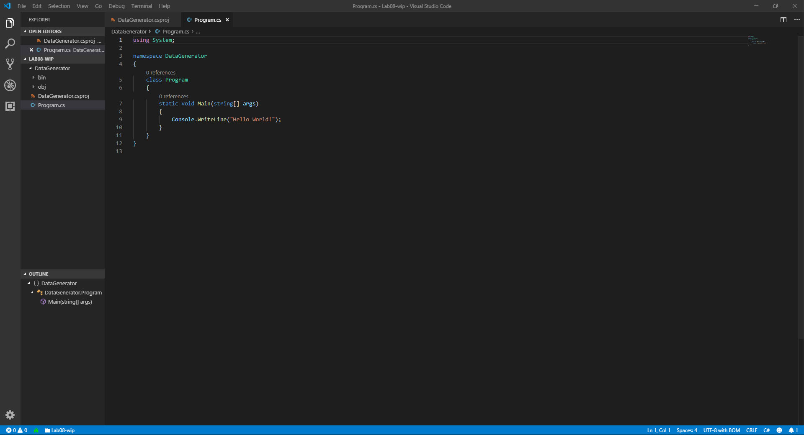
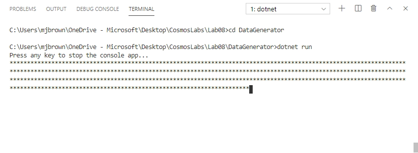
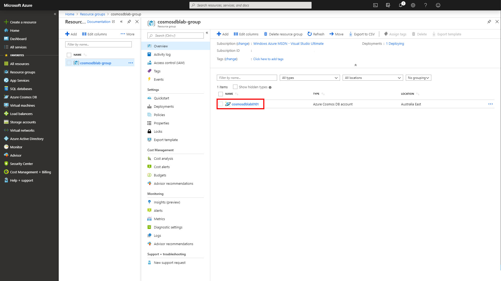
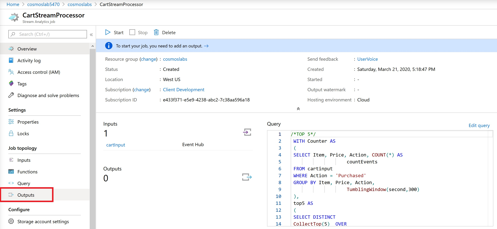
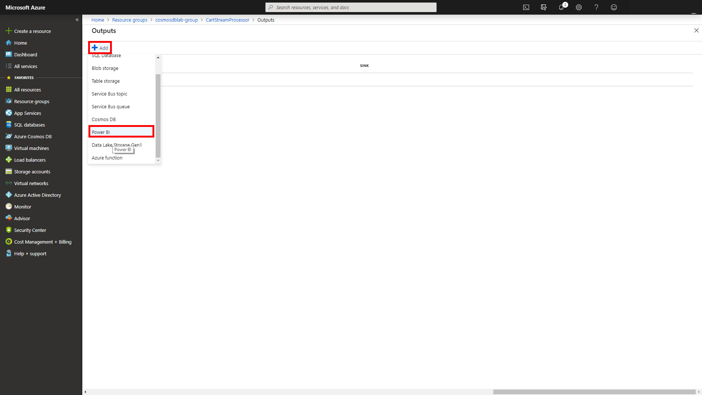
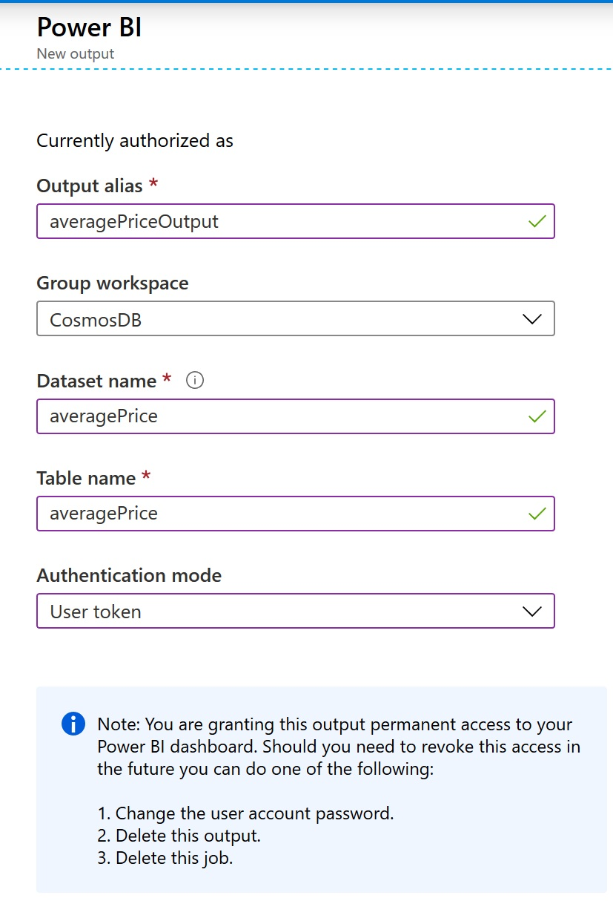
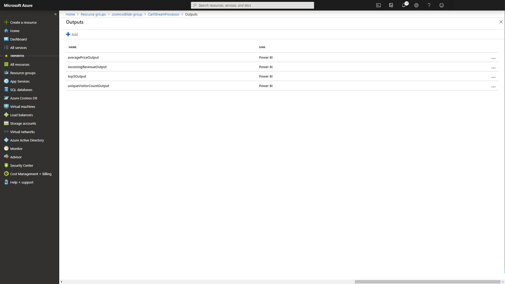
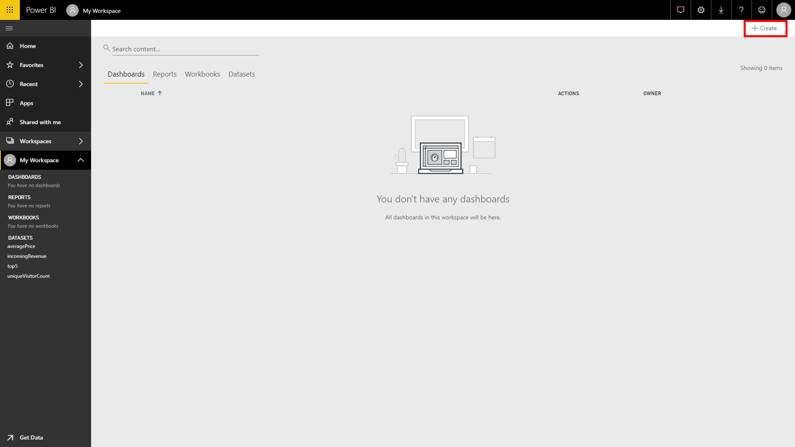
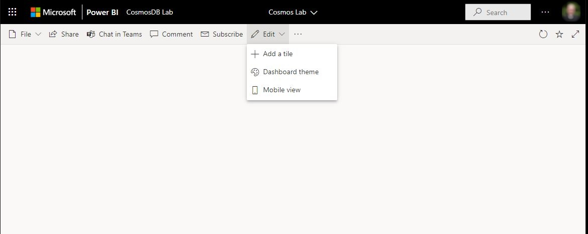

# Azure Cosmos DB Change Feed

In this lab you will use the Change Feed Processor Library and Azure Functions to implement three use cases for the Azure Cosmos DB Change Feed


## Build A .NET Console App to Generate Data

In order to simulate data flowing into our store, in the form of actions on an e-commerce website, we'll build a simple .NET Console App to generate and add documents to our Cosmos DB CartContainer

1. Create `Lab08` folder that will be used to contain the content of your .NET Core project.

1. In the `Lab08` folder, right-click the folder and select the **Open with Code** menu option.

   > Alternatively, you can run a terminal in your current directory and execute the `code .` command.

1. In the explorer pane on the left, locate the **DataGenerator** folder and expand it.

1. In the open terminal pane, enter and execute the following command:

    ```sh
    dotnet new console
    ```

    > This command will create a new .NET Core project. The project will be a **console** project and the project.

1. Visual Studio Code will most likely prompt you to install various extensions related to **.NET Core** or **Azure Cosmos DB** development. None of these extensions are required to complete the labs.

1. In the terminal pane, enter and execute the following command:

    ```sh
    dotnet add package Microsoft.Azure.Cosmos --version 3.12.0
    ```

    > This command will add the [Microsoft.Azure.Cosmos](https://www.nuget.org/packages/Microsoft.Azure.Cosmos/) NuGet package as a project dependency. The lab instructions have been tested using the `3.12.0` version of this NuGet package.

1. In the terminal pane, enter and execute the following command:

    ```sh
    dotnet add package Bogus --version 30.0.2
    ```

    > This command will add the [Bogus](./assets/https://www.nuget.org/packages/Bogus/) NuGet package as a project dependency. This library will allow us to quickly generate test data using a fluent syntax and minimal code. We will use this library to generate test documents to upload to our Azure Cosmos DB instance. The lab instructions have been tested using the `30.0.2` version of this NuGet package.

1. In the terminal pane, enter and execute the following command:

    ```sh
    dotnet restore
    ```

    > This command will restore all packages specified as dependencies in the project.

1. In the terminal pane, enter and execute the following command:

    ```sh
    dotnet build
    ```

    > This command will build the project.

1. Select the `program.cs` link in the **Explorer** pane to open the file in the editor.

   

1. For the `_endpointUrl` variable, replace the placeholder value with the **URI** value and for the `_primaryKey` variable, replace the placeholder value with the **PRIMARY KEY** value from your Azure Cosmos DB account. Use [these instructions](00-account_setup.md) to get these values if you do not already have them:

   - For example, if your **url** is `https://cosmosacct.documents.azure.com:443/`, your new variable assignment will look like this:

   ```csharp
   private static readonly string _endpointUrl = "https://cosmosacct.documents.azure.com:443/";
   ```

   - For example, if your **primary key** is `elzirrKCnXlacvh1CRAnQdYVbVLspmYHQyYrhx0PltHi8wn5lHVHFnd1Xm3ad5cn4TUcH4U0MSeHsVykkFPHpQ==`, your new variable assignment will look like this:

   ```csharp
   private static readonly string _primaryKey = "elzirrKCnXlacvh1CRAnQdYVbVLspmYHQyYrhx0PltHi8wn5lHVHFnd1Xm3ad5cn4TUcH4U0MSeHsVykkFPHpQ==";
   ```

### Create Function to Add Documents to Cosmos DB

The key functionality of the console application is to add documents to our Cosmos DB to simulate activity on our e-commerce website. Here, you'll create a data definition for these documents and define a function to add them

1.In the Visual Studio Code window, look in the Explorer pane and verify that you have a DataModel.cs file in your Shared  project folder. This file contains the data classes you will be working with in the following steps. If it is not in your Shared project folder, you can copy it from this path in the cloned repo here 'C:\Labs\setup\templates\Lab08\DataModel.cs'

2. Within the `program.cs` file in the **DataGenerator** folder, locate the `AddItem()` method. The purpose of this method is to add an instance of **CartAction** to our CosmosDB Container.
   ```sh
   private static async Task AddItem(CartAction item)
        {
            using (var client = new CosmosClient(_endpointUrl, _primaryKey))
            {
                var db = client.GetDatabase(_databaseId);
                var container = db.GetContainer(_containerId);

                await container.CreateItemAsync(item, new PartitionKey(item.Item));
            }
        }
    ```

   > If you'd like to review how to add documents to a CosmosDB container, [refer to Lab 01 ](01-creating_partitioned_collection.md).

### Create a Function to Generate Random Shopping Data

1. Within the `Program.cs` file in the **DataGenerator** folder, locate the `GenerateActions()` method. The purpose of this method is to create randomized **CartAction** objects that you'll consume using the CosmosDB change feed.

 ```sh
   private static List<CartAction> GenerateActions()
        {
            Randomizer random = new();

            var items = new string[]
            {
                "Unisex Socks", "Women's Earring", "Women's Necklace", "Unisex Beanie",
                "Men's Baseball Hat", "Unisex Gloves", "Women's Flip Flop Shoes", "Women's Silver Necklace",
                "Men's Black Tee", "Men's Black Hoodie", "Women's Blue Sweater", "Women's Sweatpants",
                "Men's Athletic Shorts", "Women's Athletic Shorts", "Women's White Sweater", "Women's Green Sweater",
                "Men's Windbreaker Jacket", "Women's Sandal", "Women's Rainjacket", "Women's Denim Shorts",
                "Men's Fleece Jacket", "Women's Denim Jacket", "Men's Walking Shoes", "Women's Crewneck Sweater",
                "Men's Button-Up Shirt", "Women's Flannel Shirt", "Women's Light Jeans", "Men's Jeans",
                "Women's Dark Jeans", "Women's Red Top", "Men's White Shirt", "Women's Pant", "Women's Blazer Jacket", "Men's Puffy Jacket",
                "Women's Puffy Jacket", "Women's Athletic Shoes", "Men's Athletic Shoes", "Women's Black Dress", "Men's Suit Jacket", "Men's Suit Pant",
                "Women's High Heel Shoe", "Women's Cardigan Sweater", "Men's Dress Shoes", "Unisex Puffy Jacket", "Women's Red Dress", "Unisex Scarf",
                "Women's White Dress", "Unisex Sandals", "Women's Bag"
            };

            var states = new string[]
            {
                "AL","AK","AS","AZ","AR","CA","CO","CT","DE","DC","FM","FL","GA","GU","HI","ID","IL","IN",
                "IA","KS","KY","LA","ME","MH","MD","MA","MI","MN","MS","MO","MT","NE","NV","NH","NJ","NM",
                "NY","NC","ND","MP","OH","OK","OR","PW","PA","PR","RI","SC","SD","TN","TX","UT","VT","VI",
                "VA","WA","WV","WI","WY"
            };

            var prices = new double[]
            {
               3.75, 8.00, 12.00, 10.00,
                17.00, 20.00, 14.00, 15.50,
                9.00, 25.00, 27.00, 21.00, 22.50,
                22.50, 32.00, 30.00, 49.99, 35.50,
                55.00, 50.00, 65.00, 31.99, 79.99,
                22.00, 19.99, 19.99, 80.00, 85.00,
                90.00, 33.00, 25.20, 40.00, 87.50, 99.99,
                95.99, 75.00, 70.00, 65.00, 92.00, 95.00,
                72.00, 25.00, 120.00, 105.00, 130.00, 29.99,
                84.99, 12.00, 37.50
            };

            var actions = new List<CartAction>();

            var itemIndex = random.Number(0, items.Length - 1);
            var stateIndex = random.Number(0, states.Length - 1);

            var action = new CartAction
            {
                CartId = random.Number(1000, 99999),
                Action = random.Enum<ActionType>(),
                Item = items[itemIndex],
                Price = prices[itemIndex],
                BuyerState = states[stateIndex]
            };

            if (action.Action != ActionType.Viewed)
            {
                var previousActions = new List<ActionType> { ActionType.Viewed };

                if (action.Action == ActionType.Purchased)
                {
                    previousActions.Add(ActionType.Added);
                }

                foreach (var previousAction in previousActions)
                {
                    var previous = new CartAction
                    {
                        CartId = action.CartId,
                        Action = previousAction,
                        Item = action.Item,
                        Price = action.Price,
                        BuyerState = action.BuyerState
                    };

                    actions.Add(previous);
                }
            }

            actions.Add(action);
            return actions;
        }

   ```
At this point, your Program.cs file should look like this:

 ```sh
   class Program
    {
        private static readonly string _endpointUrl = "<your-endpoint-url>";
        private static readonly string _primaryKey = "<your-primary-key>";
        private static readonly string _databaseId = "StoreDatabase";
        private static readonly string _containerId = "CartContainer";

        private readonly Randomizer _random = new();


        static async Task Main(string[] args)
        {
            Console.WriteLine("Press any key to stop the console app...");

            var tasks = new List<Task>();

            while (!Console.KeyAvailable)
            {
                foreach (var action in GenerateActions())
                {
                    await AddItem(action);
                    Console.Write("*");
                }
            }

            await Task.WhenAll(tasks);
        }

        private static List<CartAction> GenerateActions()
        {
            Randomizer random = new();

            var items = new string[]
            {
                "Unisex Socks", "Women's Earring", "Women's Necklace", "Unisex Beanie",
                "Men's Baseball Hat", "Unisex Gloves", "Women's Flip Flop Shoes", "Women's Silver Necklace",
                "Men's Black Tee", "Men's Black Hoodie", "Women's Blue Sweater", "Women's Sweatpants",
                "Men's Athletic Shorts", "Women's Athletic Shorts", "Women's White Sweater", "Women's Green Sweater",
                "Men's Windbreaker Jacket", "Women's Sandal", "Women's Rainjacket", "Women's Denim Shorts",
                "Men's Fleece Jacket", "Women's Denim Jacket", "Men's Walking Shoes", "Women's Crewneck Sweater",
                "Men's Button-Up Shirt", "Women's Flannel Shirt", "Women's Light Jeans", "Men's Jeans",
                "Women's Dark Jeans", "Women's Red Top", "Men's White Shirt", "Women's Pant", "Women's Blazer Jacket", "Men's Puffy Jacket",
                "Women's Puffy Jacket", "Women's Athletic Shoes", "Men's Athletic Shoes", "Women's Black Dress", "Men's Suit Jacket", "Men's Suit Pant",
                "Women's High Heel Shoe", "Women's Cardigan Sweater", "Men's Dress Shoes", "Unisex Puffy Jacket", "Women's Red Dress", "Unisex Scarf",
                "Women's White Dress", "Unisex Sandals", "Women's Bag"
            };

            var states = new string[]
            {
                "AL","AK","AS","AZ","AR","CA","CO","CT","DE","DC","FM","FL","GA","GU","HI","ID","IL","IN",
                "IA","KS","KY","LA","ME","MH","MD","MA","MI","MN","MS","MO","MT","NE","NV","NH","NJ","NM",
                "NY","NC","ND","MP","OH","OK","OR","PW","PA","PR","RI","SC","SD","TN","TX","UT","VT","VI",
                "VA","WA","WV","WI","WY"
            };

            var prices = new double[]
            {
               3.75, 8.00, 12.00, 10.00,
                17.00, 20.00, 14.00, 15.50,
                9.00, 25.00, 27.00, 21.00, 22.50,
                22.50, 32.00, 30.00, 49.99, 35.50,
                55.00, 50.00, 65.00, 31.99, 79.99,
                22.00, 19.99, 19.99, 80.00, 85.00,
                90.00, 33.00, 25.20, 40.00, 87.50, 99.99,
                95.99, 75.00, 70.00, 65.00, 92.00, 95.00,
                72.00, 25.00, 120.00, 105.00, 130.00, 29.99,
                84.99, 12.00, 37.50
            };

            var actions = new List<CartAction>();

            var itemIndex = random.Number(0, items.Length - 1);
            var stateIndex = random.Number(0, states.Length - 1);

            var action = new CartAction
            {
                CartId = random.Number(1000, 99999),
                Action = random.Enum<ActionType>(),
                Item = items[itemIndex],
                Price = prices[itemIndex],
                BuyerState = states[stateIndex]
            };

            if (action.Action != ActionType.Viewed)
            {
                var previousActions = new List<ActionType> { ActionType.Viewed };

                if (action.Action == ActionType.Purchased)
                {
                    previousActions.Add(ActionType.Added);
                }

                foreach (var previousAction in previousActions)
                {
                    var previous = new CartAction
                    {
                        CartId = action.CartId,
                        Action = previousAction,
                        Item = action.Item,
                        Price = action.Price,
                        BuyerState = action.BuyerState
                    };

                    actions.Add(previous);
                }
            }

            actions.Add(action);
            return actions;
        }

        private static async Task AddItem(CartAction item)
        {
            using (var client = new CosmosClient(_endpointUrl, _primaryKey))
            {
                var db = client.GetDatabase(_databaseId);
                var container = db.GetContainer(_containerId);

                await container.CreateItemAsync(item, new PartitionKey(item.Item));
            }
        }
    }

   ```

### Run the Console App and Verify Functionality

You're ready to run the console app, and in this step you'll take a look at your Cosmos DB account to ensure test data is being written as expected.

1. Open a terminal window
2. In the terminal pane, enter and execute the following command to run your console app:

   ```sh
   cd DataGenerator

   dotnet run
   ```

3. After a brief build process, you should begin to see the asterisks being printed as data is being generated and written to Cosmos DB.

   

4. Let the console app run for a minute or two and then stop it by pressing any key in the console.

5. Switch to the Azure Portal and your Cosmos DB Account.

6. In the Add Container popup, perform the following actions:
    
   In the Database id field, select the Create new option and enter the value **StoreDatabase**.

   Do not check the Provision database throughput option.

   Provisioning throughput for a database allows you to share the throughput among all the containers that belong to that database. Within an Azure Cosmos DB     database,   you can have a set of containers which shares the throughput as well as containers, which have dedicated throughput.

   In the Container Id field, enter the value **CartContainer**.

   In the Partition key field, enter the value **/Item**.   

   Select the OK button.

   Wait for the creation of the new database and container to finish before moving on with this lab.
 
7. From within the **Azure Cosmos DB** blade, select the **Data Explorer** tab on the left.

   

8. Expand the **StoreDatabase** then the **CartContainer** and select **Items**. You should see something like the following screenshot.

   > Note your data will be slightly different since it is random, the important thing is that there is data here at all

   

## Consume Cosmos DB Change Feed via the Change Feed Processor

The two main options for consuming the Cosmos DB change feed are Azure Functions and the Change Feed Processor library. We'll start with the Change Feed Processor via a simple console application

### Connect to the Cosmos DB Change Feed

The first use case we'll explore for Cosmos DB Change Feed is Live Migration. A common concern when designing a Cosmos DB container is proper selection of a partition key. You'll recall that we created our `CartContainer` with a partition key of `/Item`. What if we find out later this key is wrong? Or what if writes work better with `/Item` while reads work better with `/BuyerState` as the partition key? We can avoid analysis paralysis by using Cosmos DB Change Feed to migrate our data in real time to a second container with a different partition key!

1. Switch back to Visual Studio Code

2. Select the `Program.cs` link under the **ChangeFeedConsole** folder in the **Explorer** pane to open the file in the editor.

4. Open terminal pane, enter and execute the following commands:

       1.dotnet new console
       
       2.dotnet add package Microsoft.Azure.Cosmos --version 3.12.0
       
       3.dotnet build

4. For the `_endpointUrl` variable, replace the placeholder value with the **URI** value and for the `_primaryKey` variable, replace the placeholder value with the **PRIMARY KEY** value from your Azure Cosmos DB account.

5. Creae Container Id field, enter the value **CartContainerByState** under **StoreDatabase**
     
      In the Partition key field, enter the value **/BuyerState**
     
      Select the OK button.
     
      Wait for the creation of the new database and container to finish before moving on with this lab.

6. Notice the container configuration value at the top of the `program.cs` file, for the name of the destination container, following `_containerId`:

   ```csharp
   private static readonly string _destinationContainerId = "CartContainerByState";
   ```

   > In this case we are going to migrate our data to another container within the same database. The same ideas apply even if we wanted to migrate our data to another database entirely.

7. In order to consume the change feed we make use of a **Lease Container**. Add the following lines of code in place of `//todo: Add lab code here` to create the lease container:

   ```csharp
   ContainerProperties leaseContainerProperties = new ContainerProperties("consoleLeases", "/id");
   Container leaseContainer = await database.CreateContainerIfNotExistsAsync(leaseContainerProperties, throughput: 400);
   ```

   > The **Lease Container** stores information to allow for parallel processing of the change feed, and acts as a book mark for where we last processed changes from the feed.

8. Now, add the following lines of code directly after the **leaseContainer** definition in order to get an instance of the change processor:

   ```csharp
   var builder = container.GetChangeFeedProcessorBuilder("migrationProcessor", (IReadOnlyCollection<object> input, CancellationToken cancellationToken) => {
       Console.WriteLine(input.Count + " Changes Received");
       //todo: Add processor code here
   });

   var processor = builder
                   .WithInstanceName("changeFeedConsole")
                   .WithLeaseContainer(leaseContainer)
                   .Build();
   ```

   > Each time a set of changes is received, the `Func<T>` defined in `CreateChangeFeedProcessorBuilder` will be called. We're skipping the handling of those changes for the moment.

9. In order for our processor to run, we have to start it. Following the definition of **processor** add the following line of code:

   ```csharp
   await processor.StartAsync();
   ```

10. Finally, when a key is pressed to terminate the processor we need to end it. Locate the `//todo: Add stop code here` line and replace it with this code:

   ```csharp
   await processor.StopAsync();
   ```

11. At this point, your `Program.cs` file should look like this:

   ```csharp
   using System;
   using System.Collections.Generic;
   using System.Threading;
   using System.Threading.Tasks;
   using Microsoft.Azure.Cosmos;

   namespace ChangeFeedConsole
   {
       class Program
       {
           private static readonly string _endpointUrl = "<your-endpoint-url>";
           private static readonly string _primaryKey = "<your-primary-key>";
           private static readonly string _databaseId = "StoreDatabase";
           private static readonly string _containerId = "CartContainer";
           private static readonly string _destinationContainerId = "CartContainerByState";
           private static CosmosClient _client = new CosmosClient(_endpointUrl, _primaryKey);

           static async Task Main(string[] args)
           {

               Database database = _client.GetDatabase(_databaseId);
               Container container = db.GetContainer(_containerId);
               Container destinationContainer = db.GetContainer(_destinationContainerId);

               ContainerProperties leaseContainerProperties = new ContainerProperties("consoleLeases", "/id");
               Container leaseContainer = await  db.CreateContainerIfNotExistsAsync(leaseContainerProperties, throughput: 400);

               var builder = container.GetChangeFeedProcessorBuilder("migrationProcessor",
                  (IReadOnlyCollection<object> input, CancellationToken cancellationToken) =>
                  {
                     Console.WriteLine(input.Count + " Changes Received");
                     //todo: Add processor code here
                  });

               var processor = builder
                               .WithInstanceName("changeFeedConsole")
                               .WithLeaseContainer(leaseContainer)
                               .Build();

               await processor.StartAsync();
               Console.WriteLine("Started Change Feed Processor");
               Console.WriteLine("Press any key to stop the processor...");

               Console.ReadKey();

               Console.WriteLine("Stopping Change Feed Processor");
               await processor.StopAsync();
           }
       }
   }
   ```

### Complete the Live Data Migration

1. Within the `program.cs` file in the **ChangeFeedConsole** folder, locate the todo we left ourselves `//todo: Add processor code here`

1. Modify the signature of the `Func<T>` in the `GetChangeFeedProcessorBuilder` replacing `object` with `CartAction` as follows:

   ```csharp
   var builder = container.GetChangeFeedProcessorBuilder("migrationProcessor", 
      (IReadOnlyCollection<CartAction> input, CancellationToken cancellationToken) =>
      {
         Console.WriteLine(input.Count + " Changes Received");
         //todo: Add processor code here
      });
   ```

1. The **input** is a collection of **CartAction** documents that have changed. To migrate them, we'll simply loop through them and write them out to our destination container. Replace the `//todo: Add processor code here` with the following code:

   ```csharp
   var tasks = new List<Task>();

   foreach (var doc in input)
   {
      tasks.Add(destinationContainer.CreateItemAsync(doc, new PartitionKey(doc.BuyerState)));
   }

   return Task.WhenAll(tasks);
   ```

### Test to Confirm the Change Feed Function Works

Now that we have our first Change Feed consumer, we're ready to run a test and confirm that it works

1. Open a **second** terminal window and navigate to the **ChangeFeedConsole** folder

1. Start up your console app by running the following commands in the **second** terminal window:

   ```sh
   cd ChangeFeedConsole

   dotnet run
   ```

1. Once the function starts running you'll see the following messages in your console:

   ```sh
   Started Change Feed Processor
   Press any key to stop the processor...
   ```

   > Because this is the first we've run this consumer, there will be no data to consume. We'll start the data generator in order to start receiving changes.

1. In the **first** terminal window, navigate to the **DataGenerator** folder

1. Start the **DataGenerator** again by running the following command in the **first** terminal window

   ```sh
   dotnet run
   ```

1. You should see the asterisks start to appear again as the data is being written.

1. Soon after data starts being written, you'll start to see the following output in the **second** terminal window:

   ```sh
   100 Changes Received
   100 Changes Received
   3 Changes Received
   ...
   ```

1. After a few minutes, navigate to the **cosmosdblab** Data Explorer and expand **StoreDatabase** then **CartContainerByState** and select **Items**. You should see items populating there, and note that the Partition Key this time is `/BuyerState`.

   

1. Press any key in the **first** terminal to stop data generation

1. Let the **ChangeFeedConsole** finish running (it shouldn't take very long). You'll know it's done when it stops writing new log messages. Stop the function by pressing any key in the **second** terminal window.

> You've now written your first Cosmos DB Change Feed consumer, which writes live data to a new collection. Congrats! In the next steps we'll take a look at using Azure Functions to consume Cosmos DB change feed for two additional use cases.

## Create an Azure Function to Consume Cosmos DB Change Feed

One of the interesting features of Azure Cosmos DB is its change feed. The change feed provides support for many scenarios, three of which we'll investigate further in this lab.

### Create a .NET Core Azure Functions Project

In this exercise, we will implement .NET SDK's change feed processor library to read Azure Cosmos DB's change feed in in a scalable and fault-tolerant way. Azure Functions provide a quick and easy way to hook up with the Cosmos DB Change Feed, by implementing the change feed processor out of the box. You'll start by setting up a.NET Core Azure Functions project.

> For more information, please read the [doc](https://docs.microsoft.com/azure/cosmos-db/sql/change-feed-processor).

1. Open a terminal window and navigate to the Lab08 folder you've been using for this lab.

1. To install command line support for Azure Functions, you'll need `node.js`.

1. In your terminal pane, check your node version by running the following

   ```sh
   node --version
   ```

   > If you do not have node.js installed [download it here](https://docs.npmjs.com/getting-started/installing-node#osx-or-windows). If you are using a version older than `8.5` run the following:

   ```sh
   npm i -g node@latest
   ```

1. Enter and execute the following command to download the Azure Function tooling:

   ```sh
   npm install -g azure-functions-core-tools
   ```

   > If this command fails, refer to the previous step to setup node.js. You may need to restart your terminal window for these changes to take effect.

1. In your terminal pane, enter and execute the following command. This command creates a new Azure Functions project:

   ```sh
   func init ChangeFeedFunctions
   ```

1. When prompted, choose the **dotnet** worker runtime. Use the arrow keys to scroll up and down.

1. Change directory to the `ChangeFeedFunctions` directory created in the previous step

   ```sh
   cd ChangeFeedFunctions
   ```

1. In your terminal pane, enter and execute the following command:

   ```sh
   func new
   ```

1. When prompted, select **C#** from the list of languages. Use the arrow keys to scroll up and down.

1. When prompted, select **CosmosDBTrigger** from the list of templates. Use the arrow keys to scroll up and down.

1. When prompted, enter the name `MaterializedViewFunction` for the function

1. Open the **ChangeFeedFunctions.csproj** file and update the target framework to .NET Core 3.1

    ```xml
   <TargetFramework>netcoreapp3.1</TargetFramework>
    ```

1. In your terminal pane, enter and execute the following commands:

   ```sh
   dotnet add package Microsoft.Azure.Cosmos
   dotnet add package Microsoft.NET.Sdk.Functions --version 3.0.9
   dotnet add package Microsoft.Azure.WebJobs.Extensions.CosmosDB --version 3.0.7
   dotnet add ChangeFeedFunctions.csproj reference ..\\Shared\\Shared.csproj
   ```

1. In your terminal pane, build the project:

   ```sh
   dotnet build
   ```

1. Your first Azure Function has now been created, in Visual Studio Code and note the new **ChangeFeedFunctions** folder, expand it and explore the **local.settings.json**, and the **MaterializedViewFunction.cs** files.

## Use Cosmos DB Change Feed for the Materialized View Pattern

The Materialized View pattern is used to generate pre-populated views of data in environments where the source data format is not well suited to the applications requirements. In this example, we'll create a real time collection of sales data aggregated by State that would allow another application to quickly retrieve summary sales data

### Create the Materialized View Azure Function

1. Locate the **local.settings.json** file and select it to open it in the editor.

1. Add a new value `DBConnection` using the **Primary Connection String** parameter from your Cosmos DB account collected earlier in this lab. The **local.settings.json** file should like this:

   ```json
   {
     "IsEncrypted": false,
     "Values": {
       "AzureWebJobsStorage": "UseDevelopmentStorage=true",
       "FUNCTIONS_WORKER_RUNTIME": "dotnet",
       "DBConnection": "<your-db-connection-string>"
     }
   }
   ```

1. Select the new `MaterializedViewFunction.cs` file to open it in the editor.

   > The **databaseName**, **collectionName** and **ConnectionStringSetting** refer to the source Cosmos DB account that the function is listening for changes on.

1. Change the **databaseName** value to `StoreDatabase`

1. Change the **collectionName** value to `CartContainerByState`

   > Cosmos DB Change Feeds are guaranteed to be in order within a partition, so in this case we want to use the Container where the partition is already set to the State, `CartContainerByState`, as our source

1. Replace the **ConnectionStringSetting** placeholder with the new setting you added earlier **DBConnection**

   ```csharp
   ConnectionStringSetting = "DBConnection",
   ```

1. Between **ConnectionStringSetting** and **LeaseCollectionName** add the following line:

   ```csharp
   CreateLeaseCollectionIfNotExists = true,
   ```

1. Change the **LeaseCollectionName** value to `materializedViewLeases`

   > Lease collections are a critical part of the Cosmos DB Change Feed. They allow multiple instances of a function to operate over a collection and serve as a virtual _bookmark_ for where the function last left off.

1. Your **Run** function should now look like this:

   ```csharp
   [FunctionName("MaterializedViewFunction")]
   public static void Run([CosmosDBTrigger(
      databaseName: "StoreDatabase",
      collectionName: "CartContainerByState",
      ConnectionStringSetting = "DBConnection",
      CreateLeaseCollectionIfNotExists = true,
      LeaseCollectionName = "materializedViewLeases")]IReadOnlyList<Document> input, ILogger log)
   {
      if (input != null && input.Count > 0)
      {
         log.LogInformation("Documents modified " + input.Count);
         log.LogInformation("First document Id " + input[0].Id);
      }
   }
   ```

> The function works by polling your container on an interval and checking for changes since the last lease time. Each turn of the function may result in multiple documents that have changed, which is why the input is an IReadOnlyList of Documents.

1. Add the following using statements to the top of the `MaterializedViewFunction.cs` file:

   ```csharp
   using System.Threading.Tasks;
   using System.Linq;
   using Newtonsoft.Json;
   using Microsoft.Azure.Cosmos;
   using Shared;
   ```

1. Modify the signature of the **Run** function to be `async` with a `Task` return type. Your function should now look like the following:

   ```csharp
   [FunctionName("MaterializedViewFunction")]
      public static async Task Run([CosmosDBTrigger(
         databaseName: "StoreDatabase",
         collectionName: "CartContainerByState",
         ConnectionStringSetting = "DBConnection",
         CreateLeaseCollectionIfNotExists = true,
         LeaseCollectionName = "materializedViewLeases")]IReadOnlyList<Document> input, ILogger log)
      {
         if (input != null && input.Count > 0)
         {
            log.LogInformation("Documents modified " + input.Count);
            log.LogInformation("First document Id " + input[0].Id);
         }
      }
   ```

1. Your target this time is the container called **StateSales**. Add the following lines to the top of the **MaterializedViewFunction** to setup the destination connection. Be sure to replace the endpoint url and the key.

   ```csharp
    private static readonly string _endpointUrl = "<your-endpoint-url>";
    private static readonly string _primaryKey = "<your-primary-key>";
    private static readonly string _databaseId = "StoreDatabase";
    private static readonly string _containerId = "StateSales";
    private static CosmosClient _client = new CosmosClient(_endpointUrl, _primaryKey);
   ```

### Add a new Class for StateSales Data

1. Open `DataModel.cs` within the **Shared** folder in the editor

1. Following the definition of the **CartAction** class, add a new class as follows:

   ```csharp
   public class StateCount
   {
      [JsonProperty("id")]
      public string Id { get; set; }
      public string State { get; set; }
      public int Count { get; set; }
      public double TotalSales { get; set; }

      public StateCount()
      {
         Id = Guid.NewGuid().ToString();
      }
   }
   ```

### Update the MaterializedViewFunction to Create the Materialized View

The Azure Function receives a list of Documents that have changed. We want to organize this list into a dictionary keyed off of the state of each document and keep track of the total price and count of items purchased. We'll use this dictionary later to write data to our materialized view collection **StateSales**

1. Switch back to the **MaterializedViewFunction.cs** file in the editor

1. Locate the following section in the code for **MaterializedViewFunction.cs**

   ```csharp
   if (input != null && input.Count > 0)
   {
      log.LogInformation("Documents modified " + input.Count);
      log.LogInformation("First document Id " + input[0].Id);
   }
   ```

1. Replace the two logging lines with the following code:

   ```csharp
   var stateDict = new Dictionary<string, List<double>>();
   foreach (var doc in input)
   {
      var action = JsonConvert.DeserializeObject<CartAction>(doc.ToString());

      if (action.Action != ActionType.Purchased)
      {
         continue;
      }

      if (stateDict.ContainsKey(action.BuyerState))
      {
         stateDict[action.BuyerState].Add(action.Price);
      }
      else
      {
         stateDict.Add(action.BuyerState, new List<double> { action.Price });
      }
   }
   ```

1. Following the conclusion of this _foreach_ loop, add this code to connect to our destination container:

   ```csharp
      var database = _client.GetDatabase(_databaseId);
      var container = database.GetContainer(_containerId);

      //todo - Next steps go here
   ```

1. Because we're dealing with an aggregate collection, we'll be either creating or updating a document for each entry in our dictionary. For starters, we need to check to see if the document we care about exists. Add the following code after the `todo` line above:

   ```csharp
   var tasks = new List<Task>();

   foreach (var key in stateDict.Keys)
   {
      var query = new QueryDefinition("select * from StateSales s where s.State = @state").WithParameter("@state", key);

      var resultSet = container.GetItemQueryIterator<StateCount>(query, requestOptions: new QueryRequestOptions() { PartitionKey = new Microsoft.Azure.Cosmos.PartitionKey(key), MaxItemCount = 1 });

      while (resultSet.HasMoreResults)
      {
         var stateCount = (await resultSet.ReadNextAsync()).FirstOrDefault();

         if (stateCount == null)
         {
            //todo: Add new doc code here
         }
         else
         {
            //todo: Add existing doc code here
         }

         //todo: Upsert document
      }
   }

   await Task.WhenAll(tasks);
   ```

   > Take note of the _maxItemCount_ on the **CreateItemQuery** call. We're only expecting a single result at most because each state has at most one document.

1. In the case that the stateCount object is _null_ we'll create a new one. Replace the `//todo: Add new doc code here` section with the following code:

   ```csharp
   stateCount = new StateCount();
   stateCount.State = key;
   stateCount.TotalSales = stateDict[key].Sum();
   stateCount.Count = stateDict[key].Count;
   ```

1. In the case that the stateCount object exists, we'll update it. Replace the `//todo: Add existing doc code here` section with the following code:

   ```csharp
    stateCount.TotalSales += stateDict[key].Sum();
    stateCount.Count += stateDict[key].Count;
   ```

1. Finally, we'll do an _upsert_ (Update or Insert) operation on our destination Cosmos DB account. Replace the `//todo: Upsert document` section with the following code:

   ```csharp
   log.LogInformation("Upserting materialized view document");
   tasks.Add(container.UpsertItemAsync(stateCount, new Microsoft.Azure.Cosmos.PartitionKey(stateCount.State)));
   ```

   > We're using a list of tasks here because we can do our upserts in parallel.

1. Your **MaterializedViewFunction** should now look like this:

   ```csharp
   using System.Collections.Generic;
   using System.Threading.Tasks;
   using Microsoft.Azure.Documents;
   using Microsoft.Azure.WebJobs;
   using Microsoft.Azure.WebJobs.Host;
   using Microsoft.Extensions.Logging;
   using System.Linq;
   using Newtonsoft.Json;
   using Microsoft.Azure.Cosmos;
   using Shared;

   namespace ChangeFeedFunctions
   {
      public static class MaterializedViewFunction
      {
         private static readonly string _endpointUrl = "<your-endpoint-url>";
         private static readonly string _primaryKey = "<primary-key>";
         private static readonly string _databaseId = "StoreDatabase";
         private static readonly string _containerId = "StateSales";
         private static CosmosClient _client = new CosmosClient(_endpointUrl, _primaryKey);

         [FunctionName("MaterializedViewFunction")]
         public static async Task Run([CosmosDBTrigger(
            databaseName: "StoreDatabase",
            collectionName: "CartContainerByState",
            ConnectionStringSetting = "DBConnection",
            CreateLeaseCollectionIfNotExists = true,
            LeaseCollectionName = "materializedViewLeases")]IReadOnlyList<Document> input, ILogger log)
         {
            if (input != null && input.Count > 0)
            {
               var stateDict = new Dictionary<string, List<double>>();

               foreach (var doc in input)
               {
                  var action = JsonConvert.DeserializeObject<CartAction>(doc.ToString());

                  if (action.Action != ActionType.Purchased)
                  {
                     continue;
                  }

                  if (stateDict.ContainsKey(action.BuyerState))
                  {
                     stateDict[action.BuyerState].Add(action.Price);
                  }
                  else
                  {
                     stateDict.Add(action.BuyerState, new List<double> { action.Price });
                  }
               }

               var database = _client.GetDatabase(_databaseId);
               var container = database.GetContainer(_containerId);

               var tasks = new List<Task>();

               foreach (var key in stateDict.Keys)
               {
                  var query = new QueryDefinition("select * from StateSales s where s.State = @state").WithParameter("@state", key);

                  var resultSet = container.GetItemQueryIterator<StateCount>(query, requestOptions: new QueryRequestOptions() { PartitionKey = new Microsoft.Azure.Cosmos.PartitionKey(key), MaxItemCount = 1 });

                  while (resultSet.HasMoreResults)
                  {
                     var stateCount = (await resultSet.ReadNextAsync()).FirstOrDefault();

                     if (stateCount == null)
                     {
                        stateCount = new StateCount();
                        stateCount.State = key;
                        stateCount.TotalSales = stateDict[key].Sum();
                        stateCount.Count = stateDict[key].Count;
                     }
                     else
                     {
                        stateCount.TotalSales += stateDict[key].Sum();
                        stateCount.Count += stateDict[key].Count;
                     }

                     log.LogInformation("Upserting materialized view document");
                     tasks.Add(container.UpsertItemAsync(stateCount, new Microsoft.Azure.Cosmos.PartitionKey(stateCount.State)));
                  }
               }

               await Task.WhenAll(tasks);
            }
         }
      }
   }
   ```

### Test to Confirm the Materialized View Functions Works

1. Open three terminal windows.

1. In the **first** terminal window, navigate to the **DataGenerator** folder

1. Start the **DataGenerator** by entering and executing the following in the **first** terminal window:

   ```sh
   dotnet run
   ```

1. In a **second** terminal window, navigate to the **ChangeFeedConsole** folder

1. Start the **ChangeFeedConsole** consumer by entering and executing the following in the **second** terminal window:

   ```sh
   dotnet run
   ```

1. In the **third** terminal window, navigate to the **ChangeFeedFunctions** folder

1. In the **third** terminal window, start the Azure Functions by entering and executing the following:

   ```sh
   func host start
   ```

   > If prompted, select **Allow access**

   > Data will pass from DataGenerator > CartContainer > ChangeFeedConsole > CartContainerByState > MaterializedViewFunction > StateSales

1. You should see the asterisks in the **first** window as data is being generated, and in the **second** and **third** windows you should see console messages indicating that your functions are running.

1. Open a browser window and navigate to the Cosmos DB resource Data Explorer

1. Expand **StoreDatabase**, then **StateSales** and select **Items**

1. You should see data being populated in the container by state, select on an item to see the contents of the data.

   

1. In the **first** terminal window, press any key to stop data generation

1. In the **second** terminal window, press any key to stop data migration

1. In the **third** terminal window, let the function finish processing data by waiting for the console log messages to stop. It should only take a few seconds. Then press `Ctrl+C` to end execution of the functions.

## Use Azure Cosmos DB Change Feed to Write Data to EventHub using Azure Functions

In the final example of a Change Feed use case in this lab, you'll write a simple Azure Function to write out change data to an Azure Event Hub. You'll use a stream Processor to create real-time data outputs that you can consume in Power BI to build an e-commerce dashboard.

### Create a Power BI Account (Optional)

This step is optional, if you do not wish to follow the lab to creating the dashboard you can skip it

> To sign up for a Power BI account, visit [the Power BI site](https://powerbi.microsoft.com/en-us/) and select **Sign up free**.

1. Once logged in, create a new workspace called **CosmosDB**

### Retrieve Azure Event Hub Connection Info

1. Switch to the [Azure Portal](https://portal.azure.com)

1. On the left side of the portal, select the **Resource groups** link.

   

1. In the **Resource groups** blade, locate and select the **cosmoslabs** resource group.

   

1. In the **cosmoslabs** resource blade, and select the Event Hub namespace.

   

1. In the **Event Hub** blade, find **Shared Access Policies** under **Settings** and select it

1. In the **Shared Access Policies** blade, select the policy **RootManageSharedAccessKey**

1. In the panel that appears, copy the value for **Connection string-primary key** and save it for use later in this lab.

   

### Create Outputs for the Azure Stream Analytics Job

This step is optional, if you do not wish to connect to Power BI to visualize your Event Hub, you may skip it

1. Return to the **cosmoslabs** blade in the browser

1. In the **cosmoslabs** resource blade and select the stream analytics job

   

1. Select **Outputs** on the **CartStreamProcessor** Overview Screen

   

1. At the top of the **Outputs** page, select **+Add** and choose **Power BI**

   

1. Select the **Authorize** button and follow the login prompts to authorize this output in your Power BI account

1. In the window that appears enter the following data

   - Set _Output alias_ to `averagePriceOutput`

   - Set _Group workspace_ to `CosmosDB` or whatever name you used when you created a new workspace in Power BI

   - Set _Dataset name_ to `averagePrice`

   - Set _Table name_ to `averagePrice`

   - Set _Authentication mode_ to `User token`

   - Select **Save**

   

1. Repeat the previous step to add a second output

   - Set _Output alias_ to `incomingRevenueOutput`

   - Set _Group workspace_ to `cosmosdb`

   - Set _Dataset name_ to `incomingRevenue`

   - Set _Table name_ to `incomingRevenue`

   - Set _Authentication mode_ to `User token`

   - Select **Save**

1. Repeat the previous step to add a third output

   - Set _Output alias_ to `top5Output`

   - Set _Group workspace_ to `cosmosdb`

   - Set _Dataset name_ to `top5`

   - Set _Table name_ to `top5`

   - Set _Authentication mode_ to `User token`

   - Select **Save**

1. Repeat the previous step add a fourth (and final) output

   - Set _Output alias_ to `uniqueVisitorCountOutput`

   - Set _Group workspace_ to `cosmosdb`

   - Set _Dataset name_ to `uniqueVisitorCount`

   - Set _Table name_ to `uniqueVisitorCount`

   - Set _Authentication mode_ to `User token`

   - Select **Save**

1. Once you've completed these steps, the **Outputs** blade should look like this:

   

### Create an Azure Function to write data to the Event Hub

With all of the configuration out of the way, you'll see how simple it is to write an Azure Function to write change data to your new Event Hub in real time

1. Open a terminal window and navigate to the the **ChangeFeedFunctions** folder

1. Create a new function by entering and executing the following command:

   ```sh
   func new
   ```

   1. When prompted select **CosmosDBTrigger** as the _template_

   1. When prompted enter `AnalyticsFunction` as the _name_

1. Add the [Microsoft Azure Event Hubs](https://www.nuget.org/packages/Microsoft.Azure.EventHubs/) NuGet Package by entering and executing the following:

   ```sh
   dotnet add package Microsoft.Azure.EventHubs --version 4.3.0
   ```

1. Select new **AnalyticsFunction.cs** file to open it in the editor

1. Add the following using statements to the top of the **AnalyticsFunction.cs** file

   ```csharp
   using Microsoft.Azure.EventHubs;
   using System.Threading.Tasks;
   using System.Text;
   ```

1. Modify the signature of the **Run** function by setting

   - **databaseName** to `StoreDatabase`
   - **collectionName** to `CartContainer`
   - **ConnectionStringSetting** to `DBConnection`
   - **LeaseCollectionName** to `analyticsLeases`.

1. In between the **ConnectionStringSetting** and **LeaseCollectionName** add the following line:

   ```csharp
   CreateLeaseCollectionIfNotExists = true,
   ```

1. Modify the **Run** function to be `async`. The code file should now look like this:

   ```csharp
   using System.Collections.Generic;
   using Microsoft.Azure.Documents;
   using Microsoft.Azure.WebJobs;
   using Microsoft.Azure.WebJobs.Host;
   using Microsoft.Extensions.Logging;
   using Microsoft.Azure.EventHubs;
   using System.Threading.Tasks;
   using System.Text;

   namespace ChangeFeedFunctions
   {
       public static class AnalyticsFunction
       {
           [FunctionName("AnalyticsFunction")]
           public static async Task Run([CosmosDBTrigger(
               databaseName: "StoreDatabase",
               collectionName: "CartContainer",
               ConnectionStringSetting = "DBConnection",
               CreateLeaseCollectionIfNotExists = true,
               LeaseCollectionName = "analyticsLeases")]IReadOnlyList<Document> input, ILogger log)
           {
               if (input != null && input.Count > 0)
               {
                   log.LogInformation("Documents modified " + input.Count);
                   log.LogInformation("First document Id " + input[0].Id);
               }
           }
       }
   }
   ```

1. At the top of the class, add the following configuration parameters:

   ```csharp
   private static readonly string _eventHubConnection = "<event-hub-connection>";
   private static readonly string _eventHubName = "carteventhub";
   ```

1. Replace the placeholder in **\_eventHubConnection** with the value of the Event Hubs **Connection string-primary key** you collected earlier.

1. Start by creating an **EventHubClient** by replacing the two logging lines with the following code:

   ```csharp
   var sbEventHubConnection = new EventHubsConnectionStringBuilder(_eventHubConnection){
       EntityPath = _eventHubName
   };

   var eventHubClient = EventHubClient.CreateFromConnectionString(sbEventHubConnection.ToString());

   //todo: Next steps here
   ```

1. For each document that changed we want to write the data out to the Event Hub. Fortunately, we configured our Event Hub to expect JSON data so there's very little processing to do here. Add the following code snippet.

   ```csharp
   var tasks = new List<Task>();

   foreach (var doc in input)
   {
       var json = doc.ToString();

       var eventData = new EventData(Encoding.UTF8.GetBytes(json));

       log.LogInformation("Writing to Event Hub");
       tasks.Add(eventHubClient.SendAsync(eventData));
   }

   await Task.WhenAll(tasks);
   ```

1. The final version of the **AnalyticsFunction** looks like this:

   ```csharp
   using System.Collections.Generic;
   using Microsoft.Azure.Documents;
   using Microsoft.Azure.WebJobs;
   using Microsoft.Azure.WebJobs.Host;
   using Microsoft.Extensions.Logging;
   using Microsoft.Azure.EventHubs;
   using System.Threading.Tasks;
   using System.Text;

   namespace ChangeFeedFunctions
   {
       public static class AnalyticsFunction
       {
           private static readonly string _eventHubConnection = "<your-connection-string>";
           private static readonly string _eventHubName = "carteventhub";

           [FunctionName("AnalyticsFunction")]
           public static async Task Run([CosmosDBTrigger(
               databaseName: "StoreDatabase",
               collectionName: "CartContainer",
               ConnectionStringSetting = "DBConnection",
               CreateLeaseCollectionIfNotExists = true,
               LeaseCollectionName = "analyticsLeases")]IReadOnlyList<Document> input, ILogger log)
           {
               if (input != null && input.Count > 0)
               {
                   var sbEventHubConnection = new EventHubsConnectionStringBuilder(_eventHubConnection)
                   {
                       EntityPath = _eventHubName
                   };

                   var eventHubClient = EventHubClient.CreateFromConnectionString(sbEventHubConnection.ToString());

                   var tasks = new List<Task>();

                   foreach (var doc in input)
                   {
                       var json = doc.ToString();

                       var eventData = new EventData(Encoding.UTF8.GetBytes(json));

                       log.LogInformation("Writing to Event Hub");
                       tasks.Add(eventHubClient.SendAsync(eventData));
                   }

                   await Task.WhenAll(tasks);
               }
           }
       }
   }
   ```

### Creating a Power BI Dashboard to Test the AnalyticsFunction

1. Once again, open three terminal windows.

1. In the **first** terminal window navigate to the **DataGenerator** folder

1. In the **first** terminal window start the data generation process by entering and executing the following line:

   ```sh
   dotnet run
   ```

1. In the **second** terminal window navigate to the **ChangeFeedFunctions** folder

1. In the **second** terminal window, start the Azure Functions by entering and executing the following line:

   ```sh
   func host start
   ```

1. In the **third** terminal window navigate to the **ChangeFeedConsole** folder

1. In the **third** terminal window, start the change feed console processor by entering and executing the following line:

   ```sh
   dotnet run
   ```

### _The remaining steps are optional, if you do not wish to visualize the Event Hub output data in Power BI, you may skip them_

1. Confirm the data generator is running and that the Azure Functions and Console Change Processor are firing before proceeding to the next steps

1. Return to the **CartStreamProcessor** overview screen and select the **Start** button at the top to start the processor. When prompted choose to start the output **now**. Starting the processor may take several minutes.

> [!TIP]
> If the Stream Analytics Job fails to start it may be due to a bad connection to Event Hubs. To correct this to go **Inputs** in the Stream Analytics Job, then note the Service Bus namespace and Event Hub name, then delete the `cartInput` connection to the Event Hub and recreate it.

   

   > Wait for the processor to start before continuing

1. Open a web browser and navigate to the **Power BI** website.

1. Sign in, and choose **CosmosDB** from the left hand section

   

1. In the top right of the screen select **Create** and choose **Dashboard** give the dashboard any _Name_

1. In the **Dashboard** screen, select **Add tile** from the top

   

1. Choose **Custom Streaming Data** and hit **Next**

   

1. Choose **averagePrice** from the **Add custom streaming data tile** window

   

1. From _Visualization Type_ select **Clustered bar char**

   - Under _Axis_ select **Add Value** and select **Action**

   - Under _Value_ select **Add value** and select **AVG**

   - Select **Next**

   

   - Give it a name like `Average Price` and select **Apply**

1. Follow these same steps to add tiles for the remaining three inputs

   - For **incomingRevenue** select a **Line chart** with **Axis** set to `Time` and **Values** set to `Sum`. Set **Time window to display** to at least 30 minutes.

   - For **uniqueVisitors** select a **Card** with **Fields** set to `uniqueVisitors`

   - For **top5** select a **Clustered column chart** with **Axis** set to `Item` and **Value** set to `countEvents`

1. When complete, you'll have a dashboard that looks like the image below, updating in real time!

   

